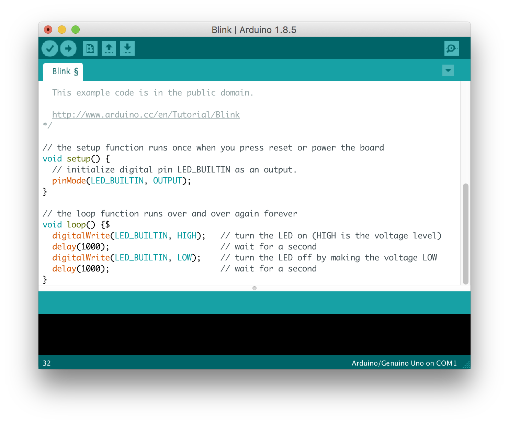

Lorem ipsum dolor sit amet, consectetur adipiscing elit, sed do eiusmod tempor incididunt ut labore et dolore magna aliqua. Semper risus in hendrerit gravida. Lacus luctus accumsan tortor posuere ac. Ultricies integer quis auctor elit sed. Diam quis enim lobortis scelerisque fermentum dui faucibus in. Interdum varius sit amet mattis vulputate enim nulla aliquet porttitor. Mattis pellentesque id nibh tortor id aliquet lectus proin nibh. Vitae elementum curabitur vitae nunc sed velit dignissim sodales. Elementum nisi quis eleifend quam adipiscing vitae proin sagittis. Fringilla urna porttitor rhoncus dolor purus. Aliquet porttitor lacus luctus accumsan tortor posuere ac ut consequat. Risus nullam eget felis eget nunc. In hac habitasse platea dictumst vestibulum rhoncus est pellentesque elit. Viverra tellus in hac habitasse platea dictumst. Rhoncus mattis rhoncus urna neque viverra. Tellus id interdum velit laoreet id. Scelerisque mauris pellentesque pulvinar pellentesque habitant morbi tristique. Adipiscing vitae proin sagittis nisl rhoncus mattis rhoncus urna neque. Nulla pharetra diam sit amet nisl suscipit adipiscing.

### Linux

TBD

| Autor | Daniel Quadros |
| :---- | :------------- |
| Data: | 15/10/2023     |
