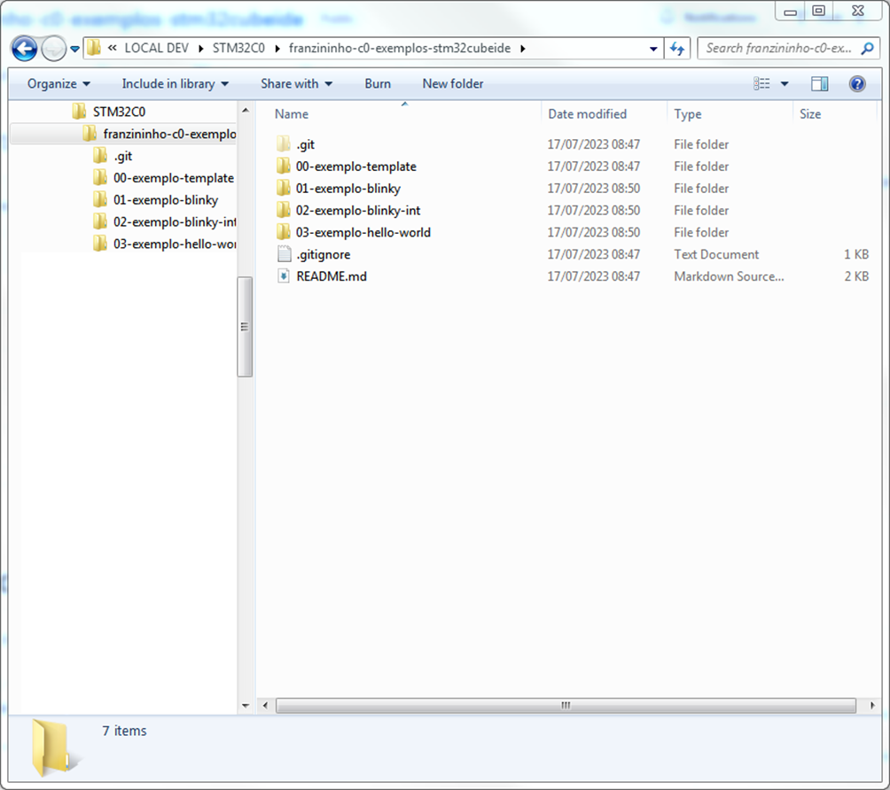
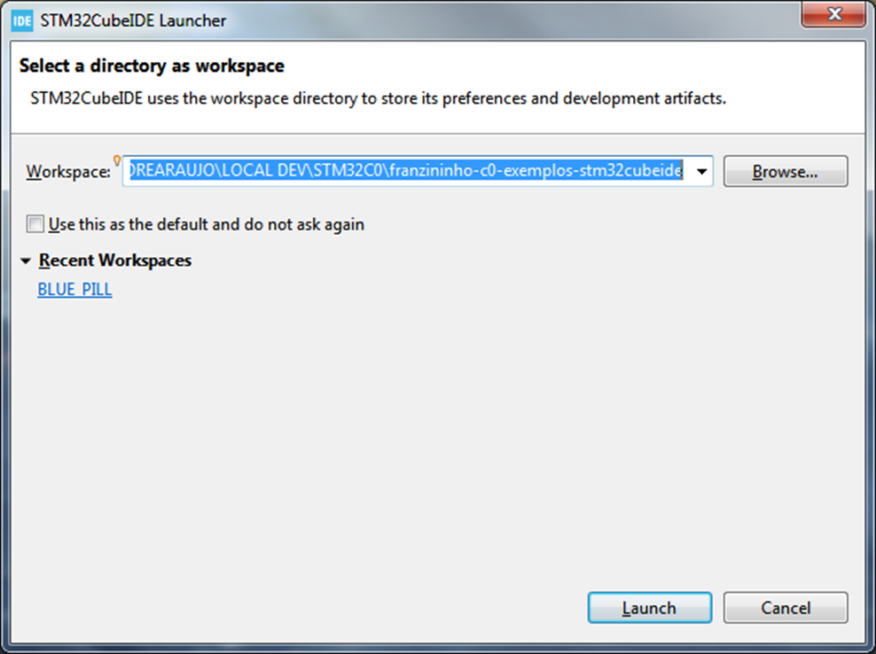
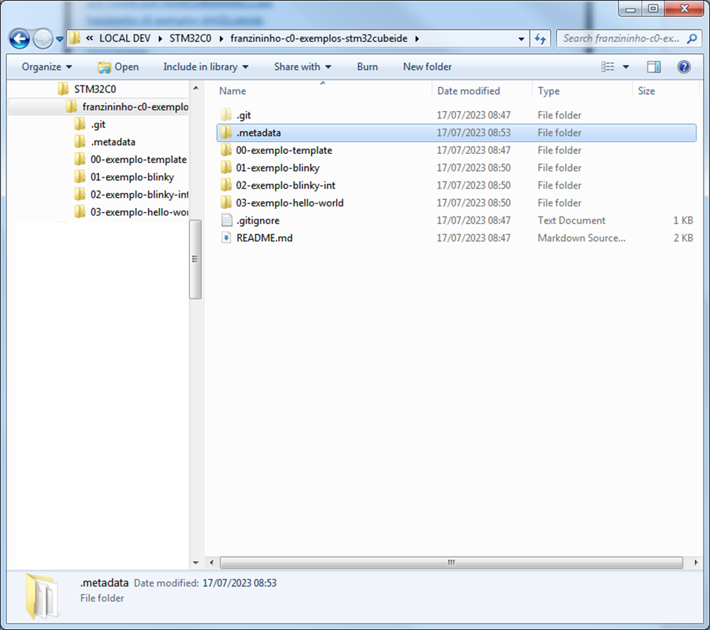
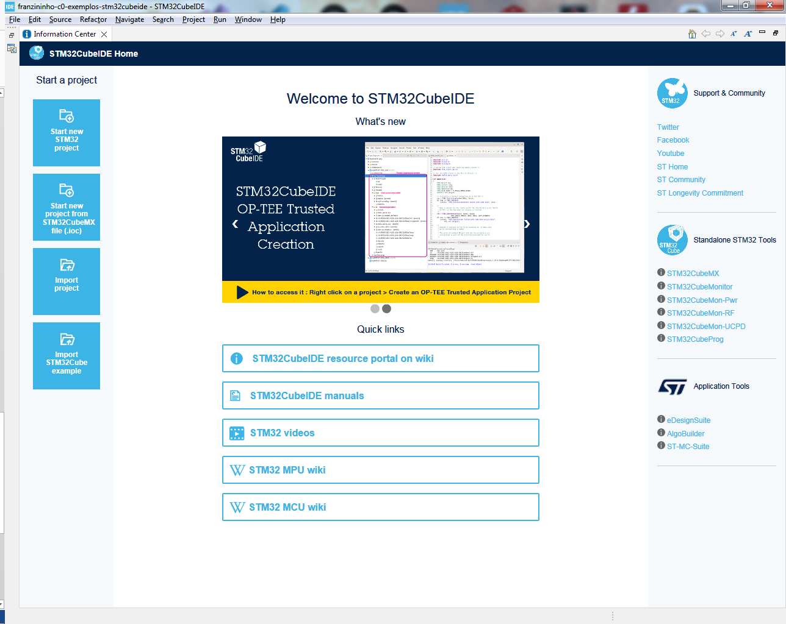
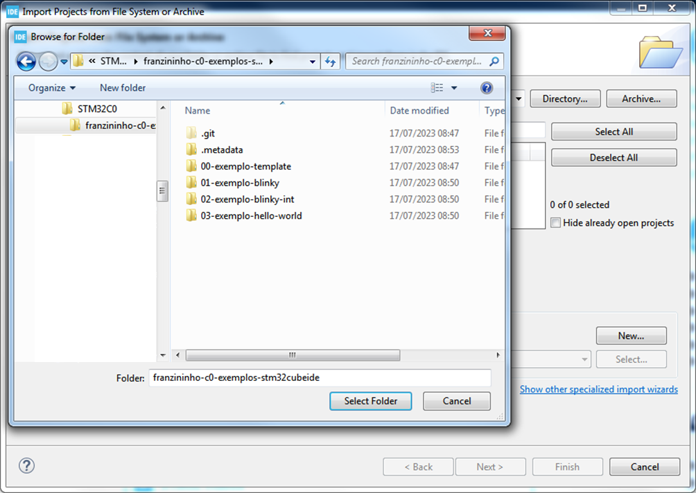
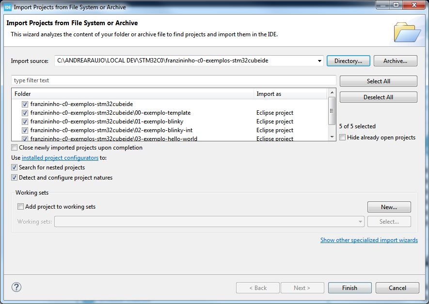
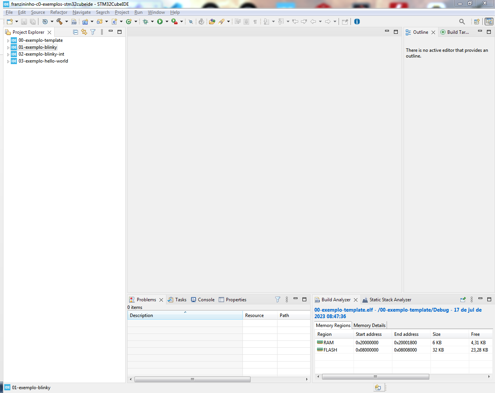

Confira abaixo os passos para você configurar um novo projeto para a Franzininho C0 para o STM32CubeIDE:

1. Clonar o repositório ([https://github.com/Franzininho/franzininho-c0-exemplos-stm32cubeide.git](https://github.com/Franzininho/franzininho-c0-exemplos-stm32cubeide.git)) em uma pasta local e chegar até o caminho que contém os exemplos:

2. Iniciar o STM32CubeIDE e selecionar a pasta do passo 1. como local do workspace, então selecionar "Launch":

3. Note que será criada a pasta "/.metadata/" no local, que contém as configurações do workspace:

4. Após inicialização do CubeIDE, selecionar "Import project":

5. Selecionar o mesmo caminho do passo 1.:

6. Note que os exemplos serão listados e pode-se selecionar quais serão importados. Para avançar, selecionar "Finish"

7. Finalmente, todos os exemplos estão carregados na IDE e prontos para compilação/execução:

| Autor | André Araújo |
|-------|-------------|
| Data: | 17/07/2023  |