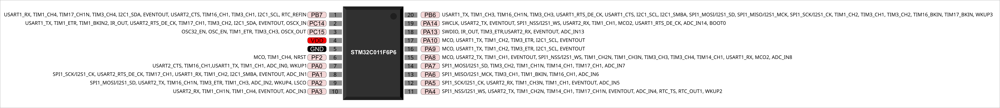

A Franzininho C0 é uma placa de desenvolvimento de hardware de código aberto, baseada no Microcontrolador STM32C0, um Arm Cortex M0+ da STMicroelectronics. Desenvolvida no Brasil, sua finalidade principal é servir como uma ferramenta de ensino/aprendizagem e prototipagem para estudantes, makers, entusiastas e desenvolvedores brasileiros.

Com um form factor pequeno e compatível com protoboard, ela pode ser programada através das ferramentas da ST e também da Arduino IDE. 

Neste texto, apresentaremos todos os recursos disponíveis e detalhes do seu hardware.

## Recursos de Hardware

- Microcontrolador: 
	- [STM32C011F6P6](https://www.st.com/en/microcontrollers-microprocessors/stm32c011f6.html) - ARM Cortex M0+ @48MHz
	- Memória Flash: 32 kB
	- Memória RAM: 6 kB
- ADC: 12 bits (13 canais + 2 internos)
- Comunicações: 1x I2C, 1 x  SPI, 2x USART
- RTC
- Timer/Contador: 8
- GPIO: 16 - Compatível com protoboard
- Conversor USB/Serial
- Conector Micro USB
- Tensão de operação: 3,3V
- Tensão de alimentação:
	- 5V via conector USB
	- 5V e GND via pinos
- Botão de USO Geral: 1
- LEDS de uso Geral: 2
- Botões: 1xReset, 1 x Boot
- Compatível com protoboard
- Dimensão: 38,1 mm x 20.32 mm
- Licença: CERN Open Hardware Licence version 2

### Pinout

### Mapeamento de recursos na placa

- Botão: PA8
- LED1: PB6
- LED2: PB7
- RX_PA10
- TX_PA11

### Pinout do microcontrolador

### Esquemático

## Licença

A placa Franzininho C0 é um projeto de hardware de código aberto, licenciado sob a **CERN Open Hardware Licence version 2**. Essa licença é utilizada em projetos de hardware que são desenvolvidos e disponibilizados como código aberto, permitindo que outras pessoas possam reproduzir e criar derivações do projeto. Para garantir a conformidade com a licença, é importante que os desenvolvedores consultem e sigam os requisitos especificados na mesma antes de reproduzir ou criar derivações do projeto. Dessa forma, podem garantir que estão seguindo as diretrizes corretas e respeitando a licença escolhida para o projeto.

Repositório: [Franzininho C0 - EasyEDA open source hardware lab](https://oshwlab.com/fabiosouza/franzininho-stm32)

## Fotos

