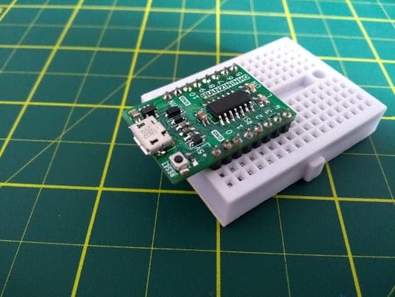

A Franzininho Tiny veio para dar squencia ao excelente trabalho feito pela Franzininho DIY. Em muitas aplicações a soldagem não é viável, assim, muitas vezes foram solicitadas placas Franzininho DIY soldadas, o que não era a proposta da placa no formato DIY.

Para facilitar, escolhemos um microcontrolador que mantenha a compatibilidade com a Franzininho DIY, porém com mais opções de pinos e no formato SMD.

A Franzininho Tiny tem um form factor compatível com protoboard e já vem montada e pronta para programar:

## Resumo de recursos

- Microcontrolador: ATtiny841
- Pinos de I/O: até 11 (alguns estão ligados a USB)
- Entradas Analógicas: até 9
- PWM: 4
- I2C: 1
- SPI: 1
- UART: 1
- Tensão de funcionamento: 5V
- Alimentação: USB(5V) ou externa (de 7,5V à 9V)

## Documentação

- [Repositório do Hardware](https://github.com/Franzininho/Franzininho-Tiny)

## Projeto Open Hardware

Assim como a Franzininho DIY, a placa Franzininho tiny também foi publicada como projeto de hardware aberto. Para essa placa foi escolhida a CERN Open Hardware Licence, uma licenças mais adequada para projetos de hardware.

Conforme definido no “how to” da licença, no repositório do projeto estão incluídos os seguintes arquivos:

- LICENSE.TXT
- cern_ohl_v_1_2_howto.pdf
- CHANGES.TXT
- COPYRIGHT.TXT
- PRODUCT.TXT

:::important Importante
Para reprodução do projeto ou derivações, é importante verificar os requisitos da licença , copyright e boas práticas.
:::

## Onde comprar

Entrar em contato: [contato@franzininho.com.br](mailto:contato@franzininho.com.br)
