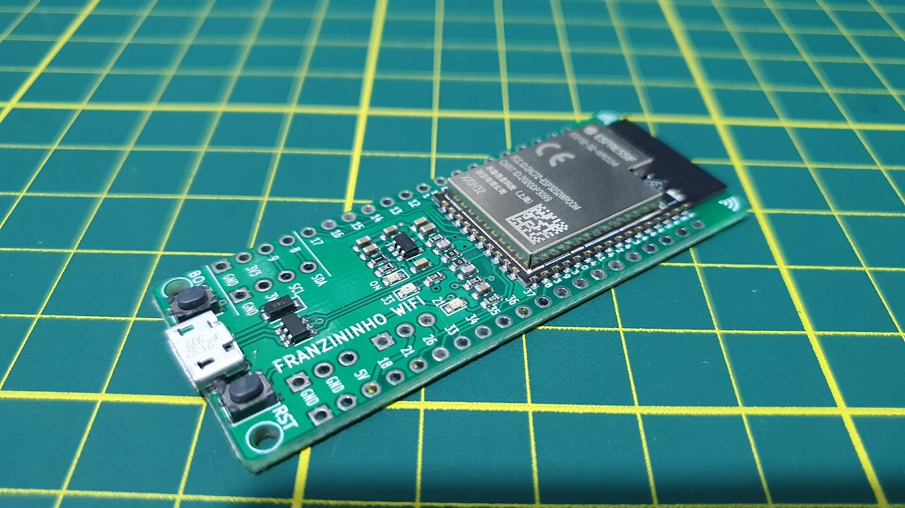

Após um ano de desenvolvimento da placa Franzininho WiFi, chegamos a uma versão estável e pronta para produção.

## Resumo de recursos da placa Franzininho WiFi:

Placa Franzininho WiFi:

- Módulo ESP32-S2 – WROOM
  - Microcontrolador Xtensa® single-core32-bit LX7 operando em até 240 MHz
  - Memórias: 128 KB de ROM, 320 KB de SRAM, 16 KB SRAM no RTC, 4MB de Flash
  - WiFi 802.11 b/g/n
  - Interfaces: GPIO, SPI, LCD, UART, I2C, I2S, Camera, IR,contador de pulsos, LED PWM, TWAI(CAN), USB 1.1 OTG, ADC, DAC, touch, sensor de temperatura interno.
- Pinout:
  - 40 pinos divididos em 2×20 headers de 2,54 mm
  - 35 GPIOs
  - Compatível com protoboard
- 2 LEDS de uso geral
- Botões: 1xReset, 1 x Boot
- USB: conector micro USB – OTG 1.1
- Alimentação:
  - 5V via conector USB
  - 5V e GND via pinos
  - 3V3 e GND via pinos
- Programação: ESP-IDF, Arduino, CircuitPyhton e MicroPython

## Pinout da Franzininho WiFi

## Licença

A licença do projeto é a [CERN Open Hardware Licence](https://ohwr.org/project/cernohl/wikis/home)..

Para reprodução do projeto ou derivações, é importante verificar os requisitos da licença, copyright e boas práticas.

Acesse o projeto no Github: [Franzininho WIFI](https://github.com/Franzininho/Franzininho-WiFi-board)
