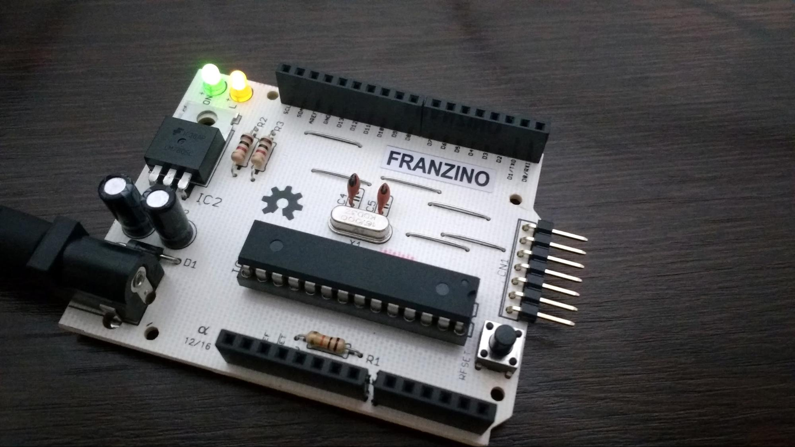
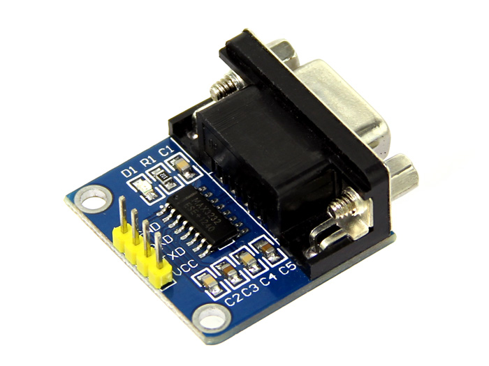
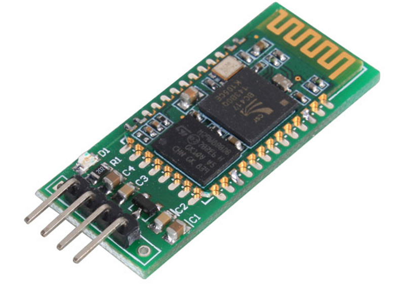
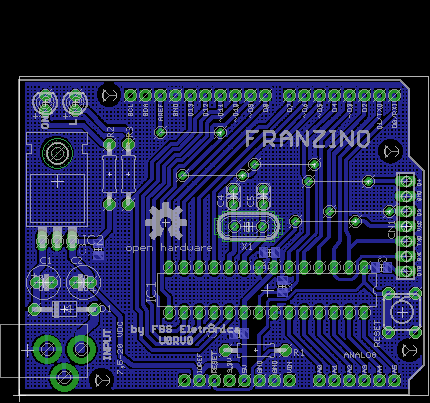

A placa Franzino é um Arduino standalone de baixo custo. Como seu próprio nome sugere, é uma placa enxuta que possui os componentes básicos para que você possa usar o microcontrolador ATmega328, tanto para estudo quanto para a aplicações em projetos.

Diferente dos standalones disponíveis no mercado, a placa Franzino possui pinagem Arduino UNO Rev 3 e conector para fácil ligação da interface serial. A facilidade de acesso aos pinos da interface serial, possibilita que você ligue módulos de comunicação conforme a necessidade do projeto. Você conseguirá facilmente ligar conversores de níveis seriais como: USB, RS232, RS485 e até mesmo um módulo Bluetooth, sem a necessidade do uso de shields.

A Franzino vem com o bootloader do Arduino UNO facilitando o processo de upload do seu scketch. Você poderá facilmente fazer o upload do seu sketch para placa usando um conversor USB/Serial, seguindo os mesmos passos que já está acostumado a fazer com a placa Arduino UNO.

## Características

- Pinagem Padrão UNO R3;
- Microcontrolador ATmega328 pu ATmega328P;
- Alimentação: 7,5 V à 20 V DC;
- Proteção contra inversão de polaridade da fonte;
- Conector para ligação de interface serial;
- LED para indicação de alimentação;
- LED conectado ao pino 13 para uso geral

A seguir é apresentada a pinagem para interface serial:

Os pino D2 e D4 podem ser utilizados para uma comunicação soft serial, como pino de controle da comunicação RS485 ou outras aplicações de entrada ou saída.

Outra vantagem interessante é que as linhas de alimentação(VCC e GND) também estão disponíveis nesse conector.

Assim, com esse conector você pode facilmente ligar um conversor USB/Serial para comunicação com um computador, seja para upload dos sketchs quanto para troca de informações.

Se o seu projeto não necessitar da comunicação USB/Serial durante o seu funcionamento, você poderá usar o mesmo conversor para fazer upload em outra Franzinos.

Algumas aplicações necessitam de comunicação serial no padrão RS232. Dessa forma você pode ligar facilmente um conversor TTL/RS232.

Também é comum aplicações que necessitem da comunicação RS485. Para isso você pode facilmente ligar um módulo conversor TTL/RS485:

Outra aplicação interessante para comunicação e o uso de módulos Bluetooth. Esse tipo de módulo pode ser facilmente ligado a Franzino tanto para uso dos pinos padrões de comunicação TX e RX quanto para comunicação soft serial:

Como observado acima, há muitas possibilidades de comunicações e você pode facilmente ligar outros módulos para diversas aplicações conforme sua necessidade.

## Limitações da Franzino

A Franzino é uma placa standalone que possui diversas vantagens. Porém como foi desenvolvida em face simples e com o mínimo de componente necessários para o uso do microcontrolador, possui algumas limitações em relação ao Arduino UNO, que são:

- Não há regulador 3,3 V, dessa forma o pino 3.3V não está conectado;
- O pino Vin não está conectado a alimentação;
- Os pinos SCL e SDA não estão conectados as pinos A4 e A5;
- Não possui conversor USB/Serial
- Precisa de um conversor USB/Serial para upload dos sketchs

## Alimentação

A Franzino pode ser alimentada das seguintes formas:

- Conector P4 com tensão de 7,5 V a 20 V como positivo no centro;
- Pino 5V e GND - tensão de alimentação fixa em 5 VDC
- Através nos pinos VCC e GND disponíveis conector de expansão serial;

## Atenção

Não LIGAR o VCC do conversor USB/SERIAL a placa se a fonte externa estiver ligada. Nesse caso ligar apenas os pinos DTR, RXI, TXO e GND.

## Esquemático

## Layout

## Licença

Esta obra está licenciada com uma Licença Creative Commons Atribuição-CompartilhaIgual 4.0 Internacional.

Todos os arquivos de projeto estão disponíveis no Github: <https://github.com/Franzininho/Franzino>

## Referências

Artigo no Embarcados: <https://www.embarcados.com.br/franzino-open-hardware-de-baixo-custo/>
