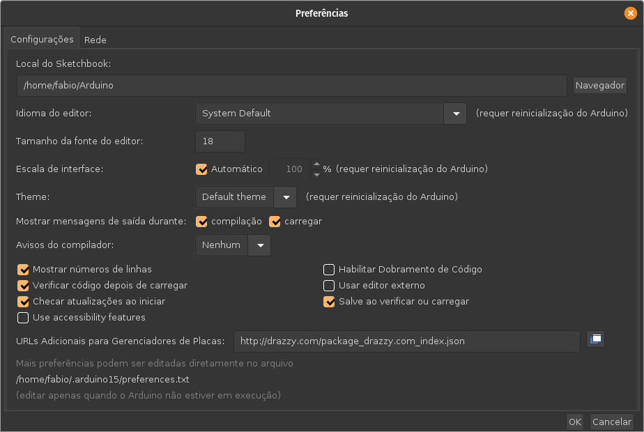
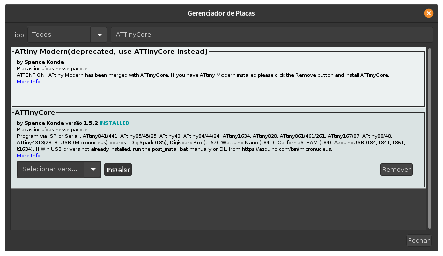
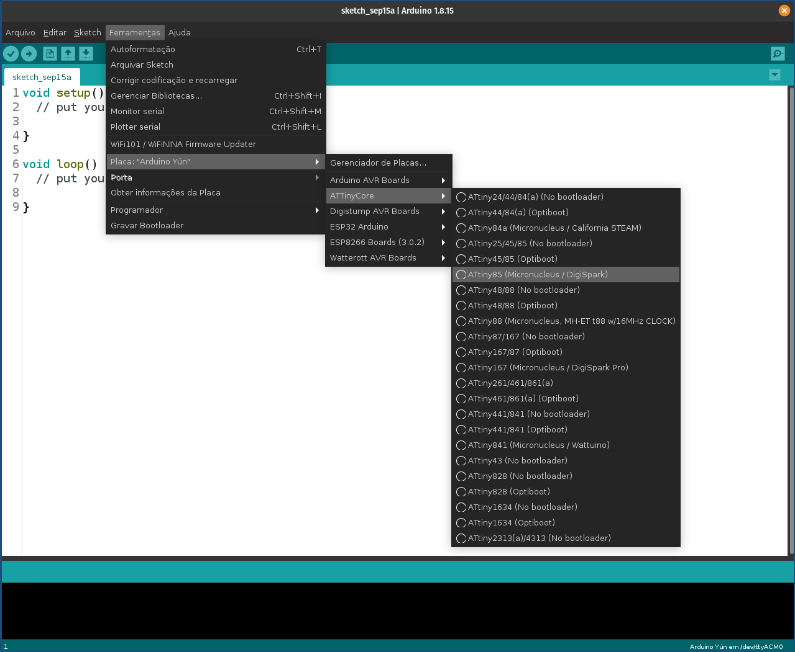
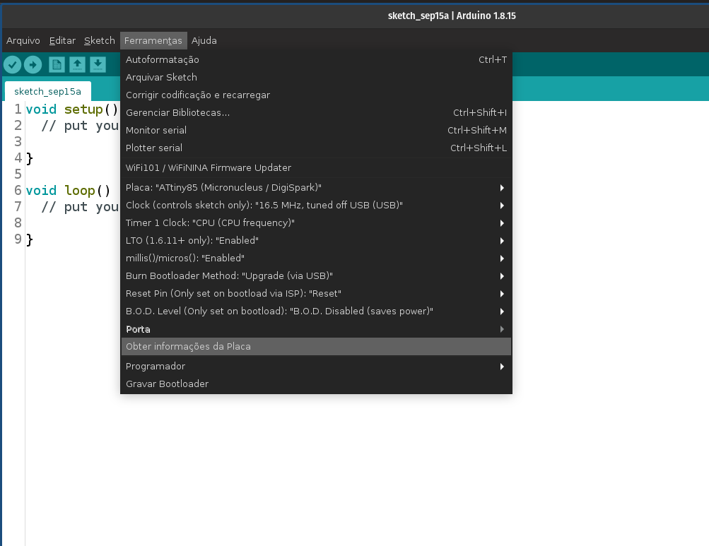
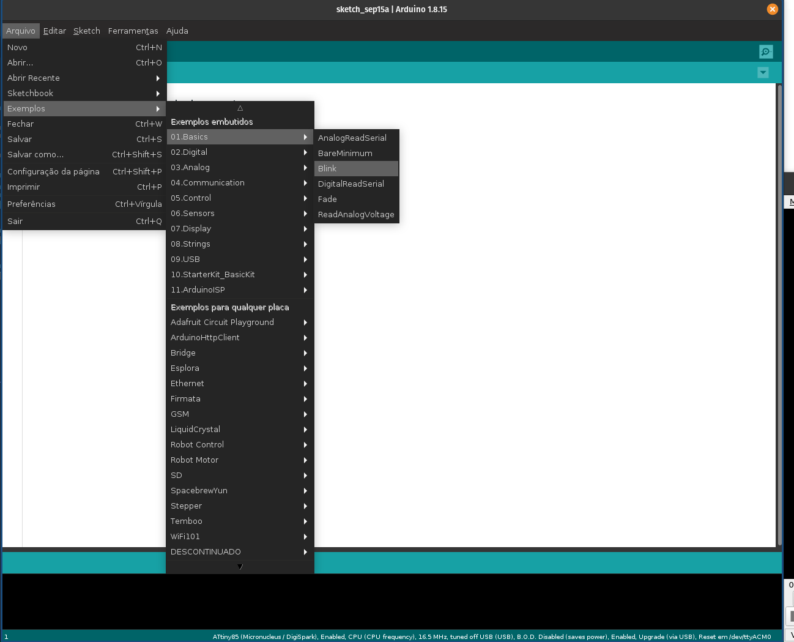
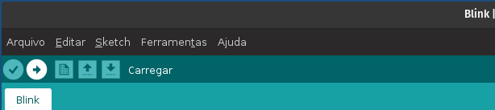
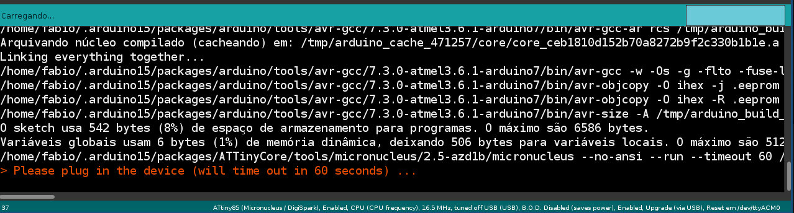
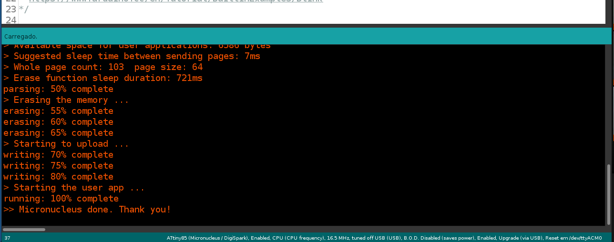

Para programação da Franzininho DIY recomendamos o uso do pacote ATtinyCore, mantido pelo Spence Konde, [aqui](https://github.com/SpenceKonde/ATTinyCore).

:::tip
Em breve teremos um pacote Franzininho que facilitará o processo de configuração da IDE. Fique ligado(a) nas atualizações.
::: 

## Configuração da Arduino IDE

Após instalar a Arduino IDE([baixe aqui](https://www.arduino.cc/en/software)), acesse **Arquivo -> Preferências ** e cole a URL a seguir em **URL Adicionais Para Gerenciadores de Placas**:

`http://drazzy.com/package_drazzy.com_index.json`

Agora, abra o Gerenciador de placas, acesse: **Ferramentas -> Placa -> Gerenciador de placas** e procure por **ATTinyCore**. Após encontrar o pacote clique em instalar e aguarde a instalação:

Pronto. agora vamos configurar a placa. Selecione a placa **ATTiny85 (Micronucleus/Digispark)**:

As demais configurações devem ficar da seguinte forma:

Agora vamos carregar um Sketch para verificarmos se está tudo certo e entendermos o processo Upload para a placa.

## Upload de código

Abra o exemplo Blink. Acesse **Arquivo -> Exemplos -> 01.Basics -> Blink**:

Agora vamos carregar o Sketch para a placa. Clique no botão **Carregar**:

Após a compilação será exibida a seguinte mensagem:

Conecte a placa na porta USB. Caso a placa ja esteja conectada pressione o botão de reset ao ver essa mensagem. O código será carregado para a placa:

Após o upload o LED amarelo da placa passará a piscar. 

Se você chegou até aqui e não teve nenhum problema, parabéns! Você já pode testar os exemplos aqui na documentação ou fazer os seus próprios projetos.

Caso tenha algum problema verifique se consegue resolver com as soluções a seguir.

## Resolvendo problemas de configuração e upload

:::warning
Em breve
:::
