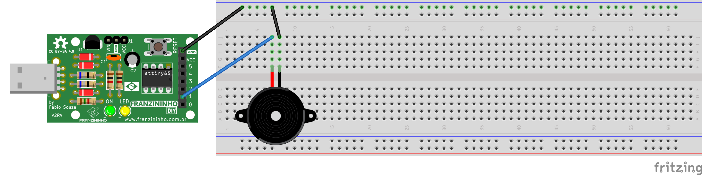

Nesse exemplo vamos criar um programa que lê uma partitura e toca a música escrita através de um buzzer na Franzininho DIY. Vamos aprender como se usar um buzzer passivo para gerar cada nota musical com ajuda do timer0.

Boa prática!

## **Recursos necessários**

- Franzininho DIY (com Micronucleos)
- 1 buzzer passivo 5v
- 4 jumpers macho-fêmea
- 1 jumper macho-macho

## **Fazendo música com o Buzzer**

Nesse exemplo vamos através de uma *lookup table* vamos ensinar quais as frequências de cada nota, e com o uso do timer vamos variar a entrada no buzzer na frequência da nota que queremos. Com a ajuda de outra tabela, vamos dar para o Franzininho a sequência das notas que queremos que ele toque, podendo assim, tocar a música que quisermos.

O buzzer passivo funciona como um pequeno alto falante, enquanto tivermos a tensão nominal na entrada positiva e o terra na entrada negativa o imã dentro dele vai para frente. Por outro lado, quando tivermos terra em ambas ele volta para a posição inicial. Se variarmos entre esses dois estados na frequência de uma nota musical geraremos uma onda sonora com o tom dela.

As notas musicais ocidentais em uma escala maior são *Do Do# Re Re# Mi Fa Fa# Sol Sol# Lá Lá# Si* voltando para *Do* depois. Cada nota está a uma distância de meio tom da outra e a 6 tons de sua próxima oitava, que é a mesma nota porém mais fina.

Olhando pela frequência temos que partindo de *Lá* da terceira oitava, 440Hz, cada *Lá* uma oitava acima tem o dobro da frequência e cada oitava a baixo tem metade da frequência. Já para subir cada semitom, basta multiplicar por 2^(1/12), ou para x semitons, 2^(x/12).

### **Código**

```c
/***********************************************
 * @file main.c
 * @author Eduardo Dueñas / Daniel Quadros
 * @brief Exemplo tocar musicas usando buzzer
 * @version 1.0
 * @date 21/04/2021
 *
 * última modificação: 15/05/2021
 **********************************************/
#include <avr/io.h>
#include <avr/interrupt.h>

#define F_CPU 16500000L

#define setBit(valor,bit)      (valor |= (1 << bit))
#define clearBit(valor,bit)    (valor &= ~(1 << bit))
#define toogleBit(valor,bit)   (valor ^= (1 << bit))
#define testBit(valor,bit)     (valor & (1 << bit))


#define NumNotas 32
#define CONT(freq) ((F_CPU*10L)/(256L*freq))

enum notas {Pausa, Do, DoS, Re, ReS, Mi, Fa, FaS, Sol, SolS, La, LaS, Si, DoM, DoSM, ReM};
long f[16] = {
    255L, (long)CONT(5232L), (long)CONT(5543L), (long)CONT(5873L), (long)CONT(6222L), (long)CONT(6592L), (long)CONT(6984L),
    (long)CONT(7400L), (long)CONT(7840L), (long)CONT(8306L), (long)CONT(8800L), (long)CONT(9323L), (long)CONT(9877L),
    (long)CONT(10465L), (long)CONT(11087L), (long)CONT(11746L)
};

// {0xFF,123, 116, 110, 104, 98, 92, 87, 82, 78, 73, 69, 65, 62, 58, 54}
// Lookup table com os valores de cada nota a ser colocado na flag do timer

char Partitura[NumNotas] = {
    Re, Mi, Mi, Re, Sol, FaS, FaS, FaS, Re, Mi, Mi, Re, La, Sol, Sol, Sol,
    Re, ReM, ReM, Si, Sol, FaS, FaS, Mi, DoM, Si, Si, Sol, La, Sol, Sol, Sol
};                                       // Partitura da música
volatile char cont = 0;                  // Local da partitura
volatile long aux = 0;

// Tratamento de interrupção
ISR (TIM0_COMPB_vect) {                  // Vetor de comparação B
  if (aux <= 0xff) {                     // Se aux menor que 8bits
    OCR0B = (TCNT0 + aux) & (0xff);      // Mandar aux para o contador
    aux = f[Partitura[cont]];            // Reinicia o aux
    toogleBit(PORTB, PB1);               // Inverter o buzzer
  }
  else {                                 // Se não
    OCR0B = TCNT0;                       // Mandar o tempoatual para o contador, o mesmo que esperar um overflow
    aux -= 0xff;                         // Subitrair 8bits do aux
  }
}

// Função main
int main() {
  enum notas nota;
  setBit(DDRB, PB1);                     // Configura o PortB1 como saída, pino do buzzer

  // Configuração do timer
  TCCR0A = 0x00;                         // Configura pino de compararação desconectado
  TCCR0B = 0x04;                         // Configura o prescaler como 256
  setBit(TIMSK, OCIE0B);                 // Habilita a interrupção por comparação de COMPB
  sei();                                 // Habilita interrupções globais
  aux = f[Partitura[cont]];              // Inicia o contador de COMPB

  if (aux <= 0xff) {
    OCR0B = (TCNT0 + aux) & (0xff);
    aux = f[Partitura[cont]];
    toogleBit(PORTB, PB1);
  }
  else {
    OCR0B = TCNT0;
    aux -= 0xff;
  }

  // Loop infinito
  for (;;) {
    long i;
    for (i = 0; i < 1000000L; i++) {
      asm ("nop");
      cont++;                            // Avança na partitura
      if (cont >= NumNotas)cont = 0;     // Toca de novo
  }
}
```

### **Montagem**



Dependendo do buzzer é necessário conectar os jumpers diretamente nos pinos do buzzer ao invés de colocá-lo na protoboard.

### **Compilação e upload**

Para compilar o programa, acesse a pasta do exemplo e dê o comando `make`:

```bash
exemplos-avr-libc/exemplos/buzzer$ make
```

Como já temos o makerfile configurado na pasta, será feita compilação e deve aparecer a seguinte mensagem:

```bash
../../micronucleus/2.0a4/launcher  -cdigispark --timeout 60 -Uflash:w:main.hex:i
Running Digispark Uploader...
Plug in device now... (will timeout in 60 seconds)
> Please plug in the device (will time out in 60 seconds) ...
```

Conecte a placa em uma entrada USB ou, caso a Franzininho já esteja conectada, aperte o botão de reset para iniciar o upload.

### **Resultado**

O buzzer deve tocar Parabéns para você e deve continuar em loop até a placa ser desligada.

[Simule esse exemplo no WokWi](https://wokwi.com/arduino/projects/302834828095521293)

## **Conclusão**

O buzzer passivo é um componente muito versátil com o qual podemos, não só, tocar músicas como também gerar diversos tipos de efeitos sonoros, tudo que precisamos é entender como gerar o som que queremos. Além disso vimos como podemos usar interrupções de timer para funções que precisam de Real Time, ou seja, que precisam de precisão de tempo.

## Glossário

- Setar: colocar um novo valor em um registrador. Para um bit é convencionado setar, mudá-lo para valor 1, e clear (limpar), mudá-lo para valor 0
- Resetar: reiniciar
- Timer: circuito eletrônico dedicado a contagem de tempo
- Lookup table: tabela de consulta, no contexto de programação é um vetor com informações necessárias para o programa.

| Autor | [Eduardo Dueñas](https://github.com/EduardoDuenas) |
|-------|-------------|
| Data: | 05/06/2020  |
