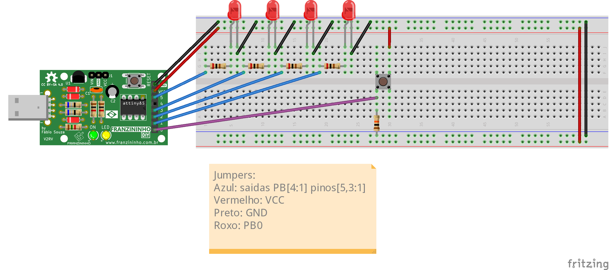
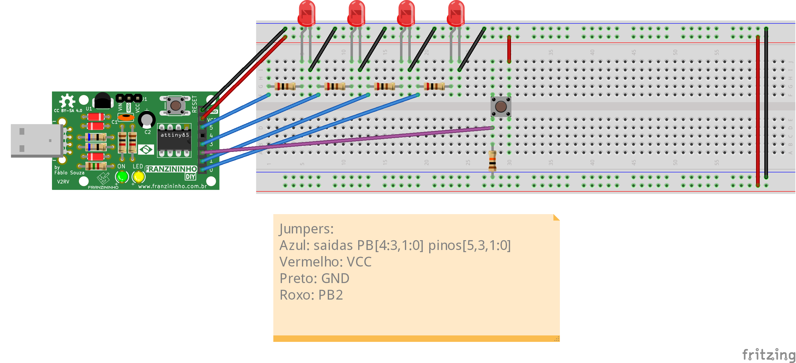

Nesses três exemplos vamos explorar gradativamente como fazer um contador de eventos externos no Franzininho DIY. Vamos explorar as formas mais simples e as mais complexas de contar eventos e as vantagens de cada uma. Nesses exemplos vamos aprender a usar o timer e a fazer debounce, necessário para lermos apenas eventos válidos e não ler o mesmo evento mais de uma vez.

Boa prática!

## **Recursos necessários**

- Franzininho DIY (com Micronucleos)
- 4 LEDs de 3mm
- 4 resistores de 200Ω
- 1 resistor de 10kΩ
- 1 chave tactil
- 7 jumpers macho-fêmea
- 7 jumpers macho-macho

## **Contadores**

Temos três exemplos de contadores da versão 1 a 3, e aumentando a complexidade do código e dos recursos utilizados.

### **Contador_v1**

Nesse exemplo vamos utilizar loops para fazer a verificação de eventos. Essa forma de se fazer a contagem, apesar de ser mais simples de se entender e criar, é pouco eficiente, tanto a nível de processamento, quanto ao de energia.

O programa é um código em linguagem C e faz uso dos nomes dos registradores definidos na biblioteca `avr/io.h`. Para melhor entendimento recomendo ler os comentários do código e o datasheet do ATtiny85.

#### **Código**
```c
/**
 * @file main.c
 * @author Eduardo Dueñas
 * @brief Exemplo de contador de eventos
 * @version 1.0
 * @date 06/04/2021
 *
 * última modificação: 05/05/2021
 */
#include <avr/io.h>

#define F_CPU 16500000L        // Frequência de CLK

// Macros
#define setBit(valor,bit)      (valor |= (1 << bit))
#define clearBit(valor,bit)    (valor &= ~(1 << bit))
#define toogleBit(valor,bit)   (valor ^= (1 << bit))
#define testBit(valor,bit)     (valor & (1 << bit))

// Debounce da chave táctil para desconsiderarmos ruído e bouncing do botão
char debounce(int pino) {
    unsigned int i;
    for (i = 0; i < 20000; i++) {   // Testa o pino várias vezes para evitar leituras erradas
      if (!(testBit(PINB, pino))) { // Testa se o pino deixou de ser 1
          return 0;            // Se sim, retorna falso
      }
    }
    return 1;                  // Retorna verdadeiro
}

int main(void) {
    // Configuração de PORTB
    clearBit(DDRB, PB0);       // Configura PB0 como entrada
    setBit(DDRB, PB1);         // Configura PB1 como saida
    setBit(DDRB, PB2);         // Configura PB2 como saida
    setBit(DDRB, PB3);         // Configura PB3 como saida
    setBit(DDRB, PB4);         // Configura PB4 como saida

    PORTB &= 0xE1;             // Manda 0 para PB[4:1]

    unsigned char count = 0;

    for (;;) {                    // loop infinito
        if (testBit(PINB, PB0)) { // Testa se PB0 é 1
            if (debounce(PB0)) {  // Verifica se realmente foi um aperto de botão
              count++;            // Se sim, incrementa o contador
              while (testBit(PINB, PB0)) {} // Espera o botão parar de ser pressionado
            }
        }
        count = count % 0x10;     // Limpa o overflow do contador
        PORTB = ((PORTB & 0xE1) | (count << 1)); // Manda o contador para PB[4:1]
    }
}
```

#### **Montagem**



Como mostrado na imagem, os LEDs são ligados nas saídas PortB[4:1] e o botão no PortB[0].

#### **Compilação e upload**

Para compilar o programa, assim como nos programas anteriores, acesse a pasta do exemplo e em seguida o comando `make`:
```
exemplos-avr-libc/exemplos/contador$ make
```
Como já temos o makerfile configurado na pasta, será feita compilação e deve aparecer a seguinte mensagem:

```
../../micronucleus/2.0a4/launcher  -cdigispark --timeout 60 -Uflash:w:main.hex:i
Running Digispark Uploader...
Plug in device now... (will timeout in 60 seconds)
> Please plug in the device (will time out in 60 seconds) ...
```
Conecte a placa em uma entrada USB ou, caso a Franzininho já esteja conectada, aperte o botão de reset para iniciar o upload.

#### **Resultado**

Os LEDs devem mostrar a contagem de apertos do botão de forma binária resetando em 0x10 ou quando resetada a placa.

#### **Análise**

Esse código é de simples compreensão usando apenas um `for` para checar continuamente se o botão foi apertado, chamando uma função debounce caso a leitura seja 1, incrementando o contador se for confirmado que a leitura é válida, esperando  o botão ser solto e mandando o valor para as saídas.

De forma geral esse código funciona, mas há muito desperdício de processamento, pois há muitos momentos que o processador não está fazendo nada, apenas esperando algo acontecer ou um certo tempo passar, nesse tempo ele poderia estar fazendo outra tarefas ou ficar em modo econômico de energia, que veremos nos próximos exemplos.

### **Contador_v2**

Nesse exemplo vamos começar a usar interrupções para ler os pulsos. Vamos ver quais são as vantagens desse método e o que pode ser melhorado.

O programa é um código em linguagem C e faz uso dos nomes dos registradores definidos na biblioteca `avr/io.h` e a biblioteca `avr/interrupt.h`. Para melhor entendimento recomendo ler os comentários do código e o datasheet do ATtiny85.

#### **Código**
```c
/**
 * @file main.c
 * @author Eduardo Dueñas
 * @brief Exemplo de contador de eventos com tratamento por interrupção
 * @version 1.0
 * @date 19/04/2021
 *
 * última modificação: 05/05/2021
 *
 * O programa é um desenvolvimento em cima do contador uma com alterações na leitura do pulso para leitura por interrupção,
 * possibilitando o uso do microcontrolador para outras funções junto do contador
 */
#include <avr/io.h>
#include <avr/interrupt.h>

#define F_CPU 16500000L        // Frequência de CLK

// Macros
#define setBit(valor,bit)      (valor |= (1 << bit))
#define clearBit(valor,bit)    (valor &= ~(1 << bit))
#define toogleBit(valor,bit)   (valor ^= (1 << bit))
#define testBit(valor,bit)     (valor & (1 << bit))

volatile unsigned char count = 0;   // Contador

ISR(INT0_vect) {
  cli();                       // Desabilita interrupções globais durante o tratamento da interrupção
  if (debounce(PB2)) {         // Se o botão foi realmente apertado incrementa cont e manda para os LEDs
    count++;                   // Incrementa o contador
    count %= 0x10;             // Limpa o excesso
    PORTB = ((PORTB & 0xE7) | ((count >> 2) << 3)); // Manda os dois bits mais significativos de cont para PB[4:3]
    PORTB = ((PORTB & 0xFC) | (count & 0x03));      // Manda os dois bits menos significativos de cont para PB[1:0]
  }
  sei();                       // Reabilita interrupções globais
}

// Debounce da chave tactil para desconsiderarmos ruído e bouncing do botão
char debounce(int pino) {
  unsigned int i;

  for (i = 0; i < 20000; i++) {   // Testa o pino várias vezes para evitar leituras erradas
    if (!(testBit(PINB, pino))) { // Testa se o pino deixou de ser 1
      return 0;                   // Se sim, retorna falso
    }
  }

  return 1;                       // Retorna verdadeiro
}

int main(void) {
    // Configuração de PORTB
    clearBit(DDRB, PB2);       // Configura PB2 como entrada
    setBit(DDRB, PB0);         // Configura PB0 como saída
    setBit(DDRB, PB1);         // Configura PB1 como saída
    setBit(DDRB, PB3);         // Configura PB3 como saída
    setBit(DDRB, PB4);         // Configura PB4 como saída

    PORTB &= 0xE4;             // Manda 0 para PB[4:3] e PB[1:0]

    //Configuração de Interrupção externa
    GIMSK |= (1 << INT0);      // Habilita interrupções externas no INT0
    MCUCR |= 0x03;             // Seta interrupções para borda de subida
    sei();                     // Habilita interrupções globais


    for (;;) {                 // Loop infinito
        // Aqui você pode colocar outra aplicação para rodar simultaneamente ao contador
    }
}
```

#### **Montagem**


Como mostrado na imagem, os LEDs são ligados nas saídas PORTB[4:3] e [1:0] e o botão na entrada PORTB[2].

#### **Compilação e upload**

Para compilar o programa, assim como nos programas anteriores, acesse a pasta do exemplo e em seguida o comando `make`:
```
exemplos-avr-libc/exemplos/contador_v2$ make
```
Como já temos o makerfile configurado na pasta, será feita compilação e deve aparecer a seguinte mensagem:

```
../../micronucleus/2.0a4/launcher  -cdigispark --timeout 60 -Uflash:w:main.hex:i
Running Digispark Uploader...
Plug in device now... (will timeout in 60 seconds)
> Please plug in the device (will time out in 60 seconds) ...
```
Conecte a placa em uma entrada USB ou, caso a Franzininho já esteja conectada, aperte o botão de reset para iniciar o upload.

#### **Resultado**

Assim como no último exemplo, os LEDs devem mostrar a contagem de eventos, mostrando em binário até 15.

#### **Análise**

Esse exemplo tem um código um pouco mais complexo, podendo fazer diferentes tarefas ao mesmo tempo com o uso de interrupções.

Interrupções são, de forma simples, instruções de alta prioridade, que fazem o processador parar o que está fazendo, guardar o estado atual, executar as instruções da interrupção e voltar para o estado anterior, continuando normalmente com o programa. Elas são extremamente úteis para tarefas que precisam de uma precisão de tempo alta ou eventos assíncronos.

Porém, apesar do exemplo dois fazer uso de interrupções, ele passa muito tempo nela, o que atrasa o andamento de um possível outro programa que estaria rodando na `main`. Porém, grande parte do tempo que é gasto na interrupção está atrelado ao debounce, que consiste basicamente de checagens em certos períodos de tempo. Podemos então otimizar o uso do processador saindo da interrupção entre as checagens, uma vez que ele está apenas esperando para fazer o próximo teste. Veremos isso e o modo de economia de energia no contador_v3.

### **Contador_v3**

Nesse exemplo vamos otimizar o processamento no código utilizando interrupções para as esperas do debounce, também veremos uma alternativa para diminuir o consumo de energia em momentos em que o processador está esperando algum evento, caso você não precise de outra rotina.

Esse programa é um código em linguagem C e faz uso dos nomes dos registradores definidos na biblioteca `avr/io.h` e a biblioteca `avr/interrupt.h`. Para melhor entendimento recomendo ler os comentários do código e o datasheet do ATtiny85.

#### **Código**
```c
/**
 * @file main.c
 * @author Eduardo Dueñas
 * @brief Exemplo de contador de eventos com tratamento por interrupção
 * @version 1.0
 * @date 20/04/2021
 *
 * última modificação: 05/05/2021
 *
 * O programa é um desenvolvimento em cima do contador_v2 uma com alterações no loop infinito que
 * havia ficado em aberto para outras aplicações para o modo sleep para diminuir o gasto de energia e
 * alterar o debounce para interrupção, aumentando a eficiência do código. O código pode ser usado com
 * outras aplicações no lugar do sleep.
 */

#include <avr/io.h>
#include <avr/interrupt.h>
#include <avr/sleep.h>

#define F_CPU 16500000L        // Frequência de CLK

#define setBit(valor,bit)      (valor |= (1 << bit))
#define clearBit(valor,bit)    (valor &= ~(1 << bit))
#define toogleBit(valor,bit)   (valor ^= (1 << bit))
#define testBit(valor,bit)     (valor & (1 << bit))

volatile unsigned char count = 0; // Contador
volatile unsigned char test = 0;  // Quantidade de testes do debounce

unsigned int pin = 0;             // Pino do debounce

// Debounce da chave tactil para desconsiderarmos ruido e bouncing do botão
char debounce(int pino) {
    pin = pino;
    // Coloca um timer para cada 1000 ciclos de clk para testar a chave tactil
    TCNT0 = 131;               // Overflow-(ciclos/Prescaler)=256-(1000/8)=131
    setBit(TIMSK, TOIE0);      // Habilita interrupções por timer overflow
    test = 0;                  // Limpa test
}

ISR(INT0_vect) {               // Tratamento de interrupções de pulso externo
    clearBit(GIMSK, INT0);     // Desabilita interrupções do INT0 durante o tratamento da interrupção
    debounce(PB2);
}

ISR(TIMER0_OVF_vect) {         // Tratamento de interrupções de timer overflow
    TCNT0 = 131;               // Seta denovo o timer para 131
    if (testBit(PINB, pin)) {  // Se o botão continua apertado
        test++;                // Incrementa test
        if (test >= 20) {      // Se testou o suficiente (no caso 20 vezes)
            count++;           // Incrementa o contador
            count %= 0x10;     // Limpa o excesso
            PORTB = ((PORTB & 0xE7) | ((count >> 2) << 3)); // Manda os dois bits mais significativos de cont para PB[4:3]
            PORTB = ((PORTB & 0xFC) | (count & 0x03));  // Manda os dois bits menos significativos de cont para PB[1:0]
            clearBit(TIMSK, TOIE0); // Desabilita interrupções por timer overflow
            setBit(GIMSK, INT0);    // Reabilita interrupções externas no INT0
        }
    }
    else {
      clearBit(TIMSK, TOIE0); // Desabilita interrupções por timer overflow
      setBit(GIMSK, INT0);    // Reabilita interrupções externas no INT0
    }
}

int main(void) {
    // Configuração de PORTB
    clearBit(DDRB, PB2);       // Configura PB2 como entrada
    setBit(DDRB, PB0);         // Configura PB0 como saida
    setBit(DDRB, PB1);         // Configura PB1 como saida
    setBit(DDRB, PB3);         // Configura PB3 como saida
    setBit(DDRB, PB4);         // Configura PB4 como saida

    PORTB &= 0xE4;             // Manda 0 para PB[4:3] e PB[1:0]

    // Configuração do timer
    TCCR0A = 0x00;             // Modo Normal
    TCCR0B = 0x00;
    TCCR0B |= 0x02;            // Prescaler de 8


    // Configuração do modo sleep
    clearBit(MCUCR, SM0);      // Configura sleep mode como idle
    clearBit(MCUCR, SM1);

    // Configuração de Interrupção externa
    setBit(GIMSK, INT0);       // Habilita interrupções externas no INT0
    MCUCR |= 0x03;             // Seta interrupções para borda de subida
    sei();                     // Habilita interrupções globais

    for (;;) {                 // Loop infinito
      // Aqui você pode colocar outra aplicação para rodar simultaneamente ao contador no lugar do sleep
      sleep_mode();            // Entra no sleep mode
    }
}
```

#### **Montagem**



Como mostrado na imagem, os LEDs são ligados nas saídas PORTB[4:3] e [1:0] e o botão na entrada PORTB[2], assim como no exemplo dois.

#### **Compilação e upload**

Para compilar o programa, assim como nos programas anteriores, acesse a pasta do exemplo e em seguida o comando `make`:
```
exemplos-avr-libc/exemplos/contador_v3$ make
```
Como já temos o makerfile configurado na pasta, será feita compilação e deve aparecer a seguinte mensagem:

```
../../micronucleus/2.0a4/launcher  -cdigispark --timeout 60 -Uflash:w:main.hex:i
Running Digispark Uploader...
Plug in device now... (will timeout in 60 seconds)
> Please plug in the device (will time out in 60 seconds) ...
```
Conecte a placa em uma entrada USB ou, caso a Franzininho já esteja conectada, aperte o botão de reset para iniciar o upload.

#### **Resultado**

Assim como nos exemplos anteriores, os LEDs do circuito devem mostrar a contagem de pulsos até 15 em binário.

#### **Análise**

Neste código adicionamos um pouco mais de complexidade, aumentando o uso de interrupções, além do uso do timer e do modo Sleep.

O modo Sleep é um mode de operação no qual, de forma básica, se desliga alguns módulos do microcontrolador até que alguma interrupção ocorra, o que pode diminuir o consumo de energia de forma drástica. No caso do código do exemplo, utilizamos o modo Idle que no ATtiny85 desliga os CLKs da CPU e FLASH, podendo se desligar opcionalmente o CLK do ADC.

O timer nesse exemplo está configurado como em modo normal, com prescaler de 8, o que faz ele incrementar o timer uma vez a cada 8 ciclos de CLK. A forma adotada para a contagem do tempo foi a interrupção por timer overflow, ou seja, sempre que o valor máximo do timer for atingido ele gera uma interrupção. Para conseguirmos os 1000 ciclos que queremos calculamos `overflow -(ciclos/Prescaler)`, que nos dá `256 -(1000/8) = 131`, e setamos o valor do timer nesse valor para que falte o tempo que desejamos para a interrupção.

O uso de interrupções do timer para o debounce diminui consideravelmente o tempo que o processador consome em execução do tratamento do evento, o que melhora o processamento das rotinas paralelas, ou no caso, permite que o processador fique mais tempo no modo Sleep, diminuindo o consumo de energia ou em caso de alimentação por baterias, aumenta a vida útil da da fonte.

## **Conclusão**

De forma geral, todas as três formas de se fazer o código funcionam, e ao servirem seu propósito não estão erradas. Porém, como programadores, principalmente de sistemas embarcados, é uma ótima prática conseguirmos fazer um código eficiente, de forma a não se tornar um empecilho no futuro, seja por usarmos muita memória ou deixarmos o processador muito lento e termos que refazer algo pronto do zero. Por isso é importante saber quais são as vantagens e desvantagens de cada método para podermos sempre utilizar o que melhor se adequa às nossas necessidades.

## Glossário

- Setar: colocar um novo valor em um registrador. Para um bit é convencionado setar, muda-lo para valor 1, e clear (limpar), muda-lo para valor 0
- Chave tactil/Push button: botão
- Debounce: correção do efeito de bouncing (efeito que ocorre em chaves que fazem rápidas conexões e desconexões antes de se estabilizar)
- Resetar: reiniciar
- Timer: circuito eletrônico dedicado a contagem de tempo


| Autor | [Eduardo Dueñas](https://github.com/EduardoDuenas) |
|-------|-------------|
| Data: | 05/05/2020  |
