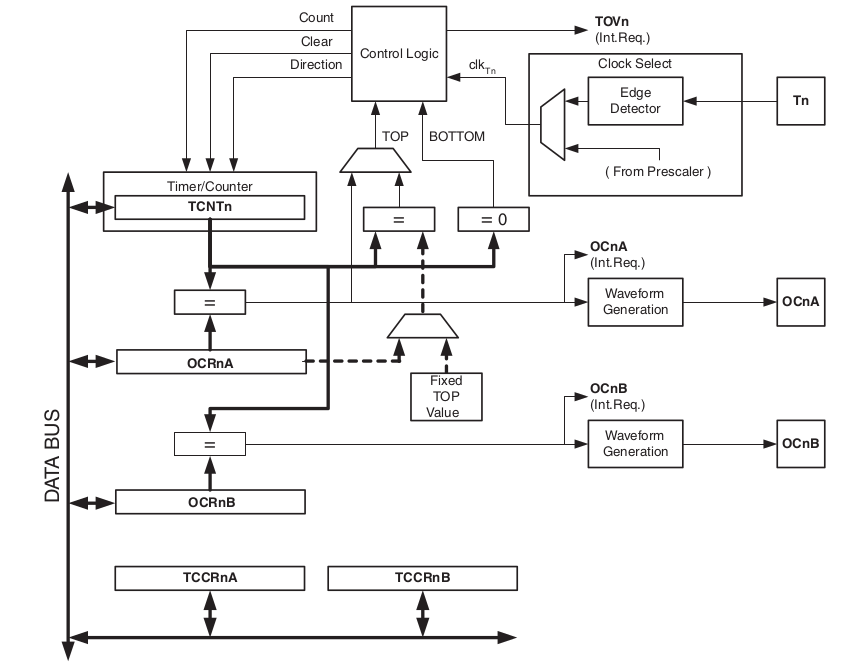
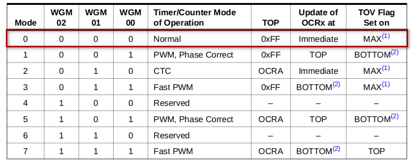

Os timers são periféricos muito importantes nos microcontroladores. Podemos usá-los para temporização, contagem de eventos, PWM, medir pulsos externos, etc. O ATtiny85 possui 2 timers, chamados de Timer0 e Timer1. Nesse exemplos vamos focar no uso do Timer0 como temporizador.

## Características do Timer0

O Timer0 é um módulo temporizador/contador de 8 bits de uso geral. Isso significa que ele pode contar de 0 a 255. A funcionalidade de temporização pode ser estendida ainda mais usando os periféricos de comparação, que permitem que o temporizador conte eventos, gere sinais PWM e assim por diante. Assim é possível gerar temporizações precisas, ondas e sinais PWM independentes da CPU.

A figura a seguir exibe o diagrama de blocos simplificado do Timer0:



## Resumo de recursos do Timer0

-   Duas unidades de comparação de saída independentes;
-   Registradores de comparação de saída com buffer duplo;
-   Limpa cronômetro na comparação de correspondência (recarregamento automático);
-   Modulador de largura de pulso com correção de fase (PWM) livre de glitch;
-   Período PWM variável;
-   Gerador de frequência;
-   Três fontes de interrupção independentes (TOV0, OCF0A e OCF0B);

## Usando o Timer0 como temporizador

Nesse exemplos vamos usar o Timer0 para gerar delay de 1s para piscar um LED.

### Passo para configurar o Timer0 como temporizador

**Passo 1:** Configurar o Timer0 para trabalhar no modo normal. Nesse modo o timer iniciará a contagem em 0 e irá até máximo de 255. Quando atingido o máximo é gerado um flag de sinalização de overflow e o timer volta a contar a partir do zero.

Para configurar o modo de operação normal, devemos configurar o registrador **TCCR0A – Timer/Counter Control Register A** da seguinte forma:

-   COM0A[1:0] e COM0B[1:0] = 0


-   WGM0[1:0] = 0 e TCCR0B – WGM02 = 0



Deve-se escrever os seguintes valores em **TCCR0A – Timer/Counter Control Register A**:

TCCR0A = 0b00000000;

**Passo 2:** Ajustar o prescaler do clock interno para 1024

Para ajustar o prescale precisamos configurar os bits CS02,CS01 e CS00 do TCCR0B:

-   TCCR0B – CS0[2:0]


Deve-se escrever os seguintes valores em **TCCR0B – Timer/Counter Control Register** B:

TCCR0B = 0b00000101;

### Calculo do Delay

Estamos trabalhando com o clock interno do ATtiny85 em 16.5Mhz. Essa é a fonte de clock para o timer0 em modo de operação normal. Como selecionamos o prescaler para dividir o clock por 1024, temos o incremento do timer0 em:

-   tempo por incremento do timer0 = 1/(16.5M/1024) = **62 us**

Assim, o tempo para o timer0 estourar(overflow) é:

-   tempo para o timer0 estourar = 62us x 256 = **15,89ms**

Portanto, para ter um delay de 1 segundo precisamos ter:

-   quantidade de overflows do timer0 = 1/15,89ms ≃ **63 vezes**

### Passos para monitorar o overflow do timer e gerar o delay de 1s

-   **Passo 0:** Colocar TCNT0 em zero
-   **Passo 1:** Aguardar a contagem do timer verificando quando TOV0 vai para 1
-   **Passo 2:** Limpar a flag TOV0 escrevendo 1 nela(Isso mesmo escrevendo 1)
-   **Passo 3:** Repetir passos 1 e 2 63 vezes para atingir 1 segundo
-   **Passo 4:** Passou um segundo – Inverter LED

### Recursos necessários

- Placa Franzininho DIY(com Micronucleus)
- LED 
- Resistor de 470 Ohm
- Jumpers
- Computador com as ferramentas de software instaladas

### Código exemplo

```c
/**
 * 
 * @file main.c
 * @author Fábio Souza
 * @brief Exibe como usar o timer zero para temporização
 * @version 0.1
 * @date 2021-02-13
 * 
 * @copyright Franzininho 
 * This example code is in the Public Domain (or CC0 licensed, at your option.)
 * Unless required by applicable law or agreed to in writing, this
 * software is distributed on an "AS IS" BASIS, WITHOUT WARRANTIES OR
 * CONDITIONS OF ANY KIND, either express or implied.
 * 
 */

#include <avr/io.h>
#include <util/delay.h> 

#define F_CPU 16500000L

 	
#define setBit(valor,bit) (valor |= (1<<bit))
#define clearBit(valor,bit) (valor &= ~(1<<bit))
#define toogleBit(valor,bit) (valor ^= (1<<bit))
#define testBit(valor,bit)    (valor & (1<<bit))

/**
 * @brief Função main
 * 
 * @return int 
 */
int main(void) 
{
  
  unsigned char tempo = 0;  //contador auxiliar

  setBit(DDRB,PB1); 	// Configura Pino PB1 como saída (Pino do LED)

  //configuração do timer0 para overflow a aproximadamente 15,89 ms
  //t = (1/16.5Mhz) x 1024 x 256 = 15,89 ms
  TCCR0A=0x00;                      //Modo Normal
  TCCR0B=0x00;
  TCCR0B |= (1<<CS00)|(1<<CS02);   //prescaler de 1024
  TCNT0=0;                         //inicia timer com 0
  
  /**
   * @brief loop infinito
   * 
   */
  while (1)
  {
    if(testBit(TIFR,TOV0))         //se timer estourou
    {
      setBit(TIFR,TOV0);           //limpa flag
      tempo++;                     //incrementa contador auxiliar
      if(tempo >=63)               //se passaram-se 63 x 15,89 ms = 1 s
      {
        toogleBit(PORTB,PB1);      //inverte LED
        tempo = 0;                 //reinicia contador
      }
    }
  }                                                
  return (0);                           
}
```
### Simulação do exemplo
- **Wokwi: **

<iframe width="100%" height="458px" src="https://wokwi.com/arduino/projects/305410400451560001?view=diagram"></iframe>

- **PICSimLab:** <https://lcgamboa.github.io/picsimlab_examples/board_Franzininho_DIY.html#board_Franzininho_DIY_attiny85>
