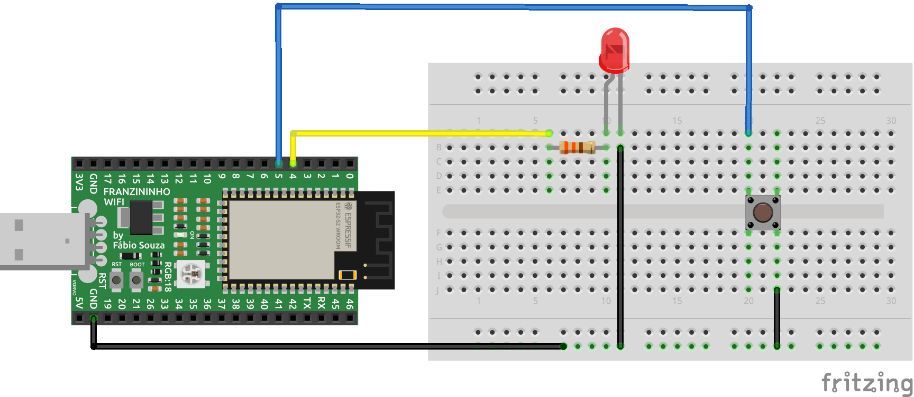

Agora que já entendemos a estrutura básica de um programa no CircuitoPython, exploraremos os pinos de I/O como entrada e saída digital. Este exemplo exibe como ler um botão (entrada digital) e acionar um LED (saída digital). Quando o botão for pressionado o estado do LED deverá ser invertido. Assim, ao final teremos um botão Liga/Desliga para controlar o LED.

## Materiais necessários

- 1 Placa Franzininho WiFi com CircuitPython;
- 1 Protoboard;
- 1 LED vermelho de 3 mm;
- 1 Resistor 330 Ω;
- 1 Botão;
- Jumpers.


## Circuito

Faça a seguinte montagem:




## Código

Digite o código abaixo no arquivo code.py que está dentro do diretório CIRCUITPY e salve o arquivo:

```python
# Entradas e Saídas digitais - Botão Liga/Desliga
import time
import board
from digitalio import DigitalInOut, Direction, Pull

# Configura o pino do botão
btn = DigitalInOut(board.IO5)      	# mapea para pino 5 
btn.direction = Direction.INPUT  	# configura como entrada
btn.pull = Pull.UP                  # habilita pull-up interno


# Configura o pino do led
led = DigitalInOut(board.IO4)       # mapea para pino 4 
led.direction = Direction.OUTPUT   	# configura como saída

# loop infinito
while True:
	if btn.value ==0:			   	# Se botão pressionado                
		led.value=not led.value		# inverte estado do LED
		while btn.value==0:			# Aguarda botão ser solto
			time.sleep(0.01)		# delay de 10 ms
```

## Análise do código

Para acessar os pinos da placa precisamos importar o módulo board:
```python
import board
```

Como precisaremos de intervalos de temporização importamos o módulo time:
```python
import time
```

Trabalharemos como entradas e saídas digitais nesse exemplo. Para isso, precisamos importar os seguintes módulos em digitalio:
```python
from digitalio import DigitalInOut, Direction
```

O botão deve ser configurado como uma entrada digital no pino 5. Além disso, como não usamos resistor de pull-up externo devemos configurar o pull-up interno:
```python
# Configura o pino do botão
btn = DigitalInOut(board.IO5)      	# mapea para pino 5 
btn.direction = Direction.INPUT  	# configura como entrada
btn.pull = Pull.UP                  # habilita pull-up interno
```

O LED foi configurado como uma saída digital no pino 4, da mesma forma que fizemos no exemplo anterior:
```python
# Configura o pino do led
led = DigitalInOut(board.IO4)       # mapea para pino 4 
led.direction = Direction.OUTPUT   	# configura como saída
```

No loop infinito testamos o valor do pio do botão, caso esteja em nível 0 significa que o usuário apertou. Assim toda vez que o botão é pressionado o valor do LED é invertido. Para evitar que o sejam realizadas diversas operações é aguardado que o usuário solte o botão antes de ler o botão novamente. Essa espera é feita com um loop 
while:

```python
# loop infinito
while True:
	if btn.value ==0:			   	# Se botão pressionado                
		led.value=not led.value		# inverte estado do LED
		while btn.value==0:			# Aguarda botão ser solto
			time.sleep(0.01)		# delay de 10 ms
```

## Conclusão

Neste exemplo, fizemos uma aplicação simples para leitura de uma entrada digital(botão) e acionamento de uma saída digital(LED). Esse exemplo servirá de base para quando você precisar trabalhar com entradas e saídas digitais em seus projetos. A configuração é sempre a mesma.

:::tip Desafio
Inclua mais um botão e mais um LED no circuito com funcionamento igual ao que fizemos.
:::

| Autor | Diana Santos |
|-------|--------------|
| Autor | [Fábio Souza](https://github.com/FBSeletronica) |
| Data: | 16/09/2021    |
