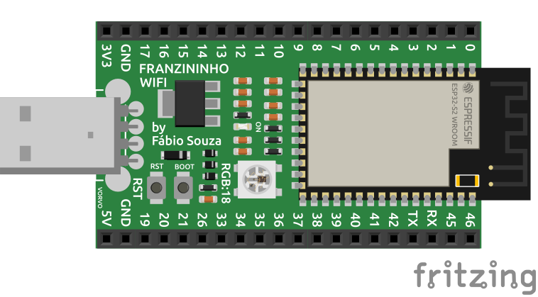
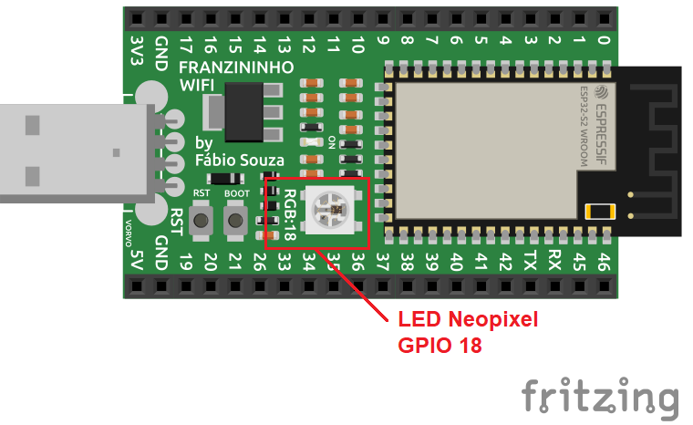
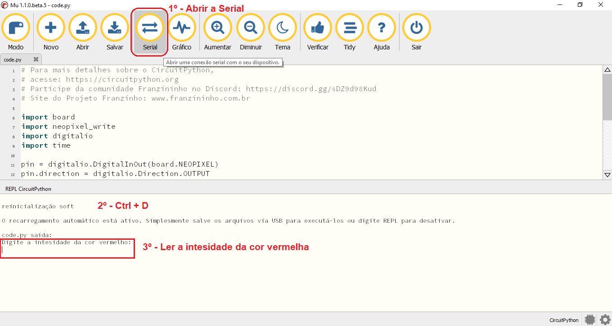
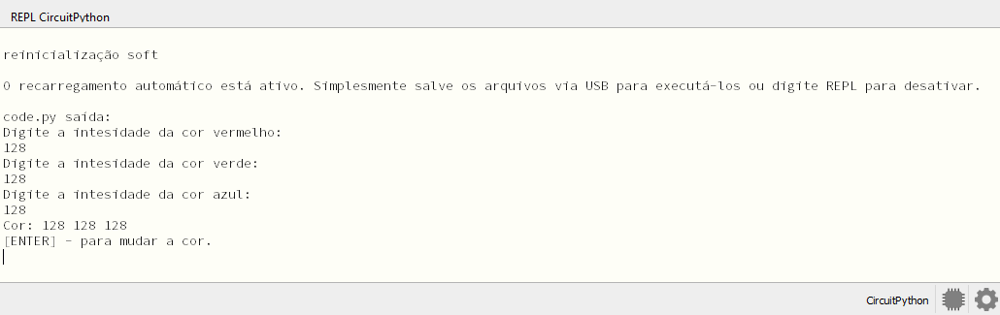
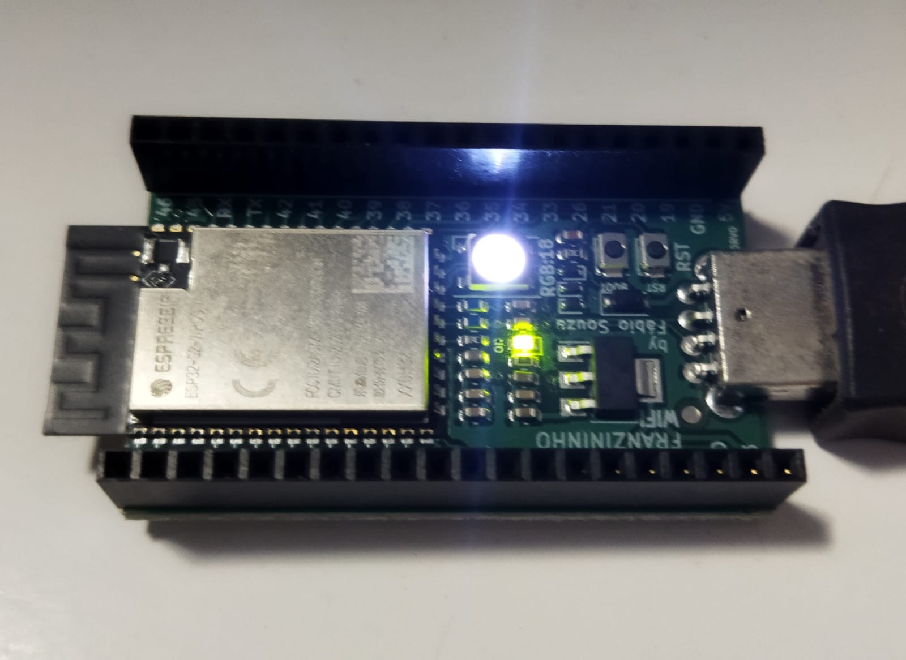
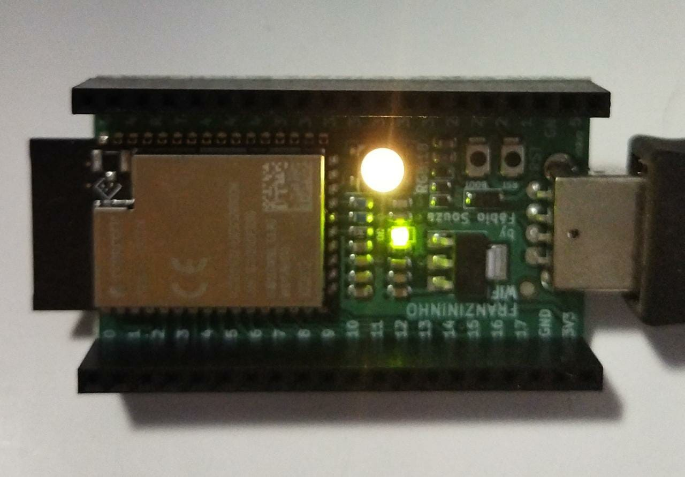

Neste exemplo iremos utilizar o console serial para controlar a cor do LED da Franzininho WiFi com CircuitPython. 


## Materiais necessários
- 1 Placa Franzininho Wifi com CircuitPython;

## Circuito
Para este exemplo não será necessário nenhum componente extra, apenas a placa Franzininho WiFi:



Obs. Neste exemplo vamos utilizar o Mu Editor, mas qualquer editor com suporte a comunicação serial pode ser utilizado.

## Código

Digite o código abaixo no arquivo code.py que está no diretório CIRCUITPY e salve o arquivo:

:::note Observação
Provavelmente você encontrará outro código no arquivo code.py. 
Apague-o e insira o código novo.
:::

```python
# code.py

""" Controle da cor do LED RGB através da serial console """
import board
import digitalio
import neopixel_write

pin = digitalio.DigitalInOut(board.NEOPIXEL)
pin.direction = digitalio.Direction.OUTPUT

while True:
    print("Digite a intesidade da cor vermelho:")
    r = int(input())
    print("Digite a intesidade da cor verde:")
    g = int(input())
    print("Digite a intesidade da cor azul:")
    b = int(input())
    cor = bytearray([r, g, b])
    neopixel_write.neopixel_write(pin, cor)
    print("Cor: {} {} {}".format(r,g,b) )
    print("[ENTER] - para mudar a cor.")
    input()
```

Finalizando a edição do arquivo, salve-o.
Após salvar o arquivo, abra o console serial do Mu Editor.


## Análise do código

Para acessar os pinos da placa precisamos importar o módulo board:

```python
import board
```

Utilizaremos o LED Neopixel existente na própria placa da Franzininho WiFi, este LED está conectado a GPIO 18 do ESP32-S2 da Franzininho WiFi.



Como o LED é um atuador, precisamos configurar o pino como uma saída digital. Para isso, precisamos importar o módulo:

```
import digitalio
```

O LED RGB Neopixel utiliza um protocolo de comunicação específico já que dentro do LED existe um chip de controle integrado que controla os três LED dentro do encapsulamento.
Para facilitar a implementação de nosso programa, optamos por utilizar um biblioteca disponível dentro do próprio circuitpython que é a neopixel_write:

```python
import neopixel_write
```

Com todos os módulos importados, podemos acessar as funções de configuração do pino digital:

```python
pin = digitalio.DigitalInOut(board.NEOPIXEL)
pin.direction = digitalio.Direction.OUTPUT
```

Note que primeiro mapeamos o pino e depois configuramos a direção.

Diferentemente de outros framework como Arduino, ESP-IDF e a maioria dos framework escrito em C/C++, o interpretador do Python já habilitar UART para a comunicação serial por padrão, dispensado a inicialização da serial como seria no Arduino por exemplo.

Fragmento de código necessário para configurar a comunicação serial no Arduino:

```c++
Serial.begin(115200);
```

:::note Dica
Nunca mais você vai esquecer de habilitar a serial antes de tentar imprimir. :wink:
:::

Neste exemplo duas funções são importante destacar. São as funções que permite escrever e ler dados do console.

A função "print" para imprimir mensagem no console serial.

```python
print("Algum coisa para ser impresso na serial")
```

E a função "input" para ler valores do console serial.

```python
uma_variavel = input()
```

Agora vamos criar nosso loop principal:

```python
while True:
    print('Digite a intensidade da cor vermelho:')
    r = int(input())
    print('Digite a intensidade da cor verde:')
    g = int(input())
    print('Digite a intensidade da cor azul:')
    b = int(input())
    cor = bytearray([r, g, b])
    neopixel_write.neopixel_write(pin, cor)
    print('Cor: {} {} {}'.format(r,g,b) )
    print('[ENTER] - para mudar a cor.')
    input()
```

No loop principal iremos utilizar as funções print/input para ler o valor das cores dos três LED.

Iremos montar um bytearray e chamar a função neopixel_write para atualizar a cor do LED Neopixel.

```python
cor = bytearray([r, g, b])
```

A função neopixel_write precisa apenas de dois parâmetros, o pino onde está conectado o LED e um bytearray contendo um byte para cada uma das cores do LED.

```python
neopixel_write.neopixel_write(pin, cor)
```

O bytearray segue o seguinte formato: primeiro byte representa a intensidade do LED vermelho (Red), o segundo byte representa a intensidade do LED verde (Green) e o terceiro byte representa a intensidade do LED azul (Blue).


## Execução

Para abrir o console serial no Mu Editor, click no botão "Serial" e depois pressione "Ctrl + D" para reiniciar a execução do script na placa. Logo em seguida você poderá ver a primeira mensagem do script, solicitado o valor da primeira cor no console, a cor vermelha.



Aqui temos um exemplo de execução no console serial do Mu Editor.



Resultado da execução na placa Franzininho WiFi.



Outro exemplo de execução.



:::tip Sugestão de experimento
Execute uma informando os valores [10,10,10], execute novamente agora informando os valores [100,100,100] e observe a diferença entre as duas execuções.
:::

## Conclusão

Neste exemplo exploramos duas importante ferramentas no desenvolvimento de qualquer projeto, a comunicação serial do console e o LED Builtin da placa Franzininho WiFi que também é um LED Neopixel que pode dar um charme a mais a seus projetos!!!

| Autor | Ewerton Leandro de Sousa |
|-------|--------------|
| Data: | 07/10/2021    |