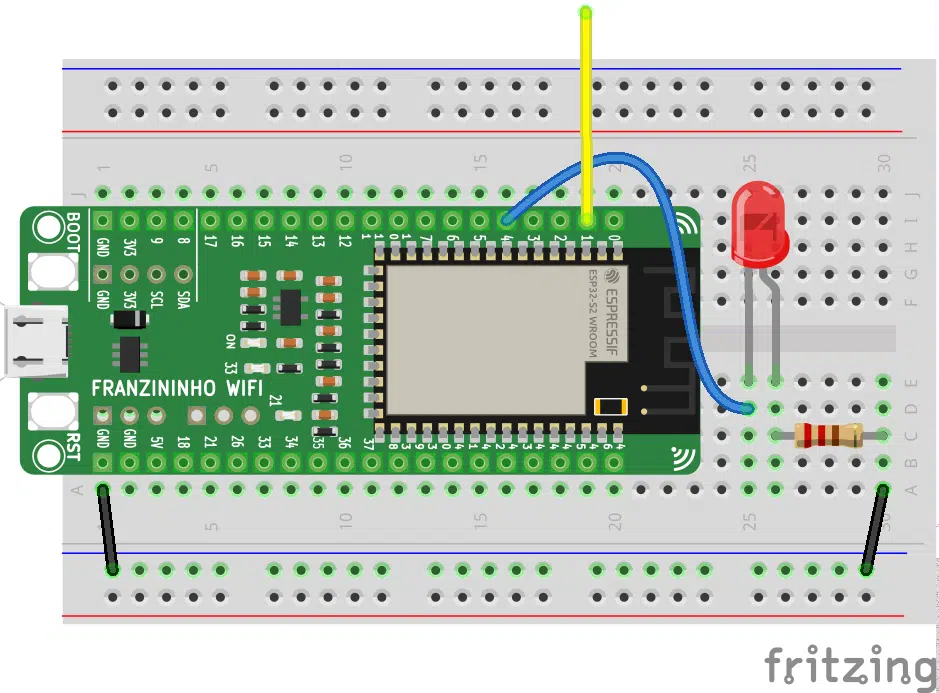

A capacitância pode ser definida, basicamente, como a capacidade de um corpo de armazenar energia elétrica. Dessa maneira, os pinos de toque capacitivo detectam a mudança na capacitância de um elemento. Esses pinos, podem ser utilizados por toque, e até mesmo, pela aproximação de um dedo.

Neste exemplo, vamos fazer um “interruptor” por aproximação e, aprender como usar o módulo responsável pelos pinos de toque capacitivo. Ademais, veremos como ajustar a sensibilidade desse recurso.

## **Materiais necessários**

-   1 Placa Franzininho WiFi com CircuitPython;
-   1 Protoboard;
-   1 LED;
-   1 resistor de 220 Ω ou 330 Ω;
-   Jumpers.

## **Circuito**

Realize a seguinte montagem para este projeto. No lugar do “sensor” de toque capacitivo, pode ser utilizado um jumper, um pedaço de fio ou qualquer outro material.



## **Código**

Implemente o código abaixo e teste seu circuito.
```python
#Toque Capacitivo

import board 
import touchio
from digitalio import DigitalInOut, Direction
from time import sleep 

estado = 0

pin = board.IO1
touch = touchio.TouchIn(pin)

led = DigitalInOut(board.IO4)
led.direction = Direction.OUTPUT

while True:
    if touch.value:
        estado = not estado
    
    led.value = estado
    sleep(1)
```

Após finalizar a edição do código, salve-o. Execute o programa. Ao aproximar, ou, encostar o dedo no “sensor” escolhido por você, ele deve funcionar como um interruptor, ligando e desligando o LED.

## **Análise do Código**

Para acessarmos os pinos da placa devemos importar o módulo **board**:
```python
import board
```
Além disso, para o uso dos pinos de toque capacitivo, usaremos a biblioteca **touchio**:
```python
import touchio
```
E, para configurarmos o LED como uma saída digital, temos que importar as funções **DigitalInOut** e **Direction** do módulo **digitalio:**
```python
from digitalio import DigitalInOut,  Direction
```
Por último, vamos chamar a função **sleep** do módulo **time**, que usaremos para intervalos de temporização:
```python
from time import sleep
```
Após importarmos as bibliotecas necessárias, criaremos uma variável **estado**, que vai armazenar o estado do LED:
```python
estado  =  0
```
Agora, vamos configurar o GPIO1, como um pino **touch**. Primeiro, iremos atribuir esse pino a uma variável, no caso, a variável **pin**. Após isso, iremos criar o objeto **touch** e atribuir o pin a esse objeto:
```python
pin  =  board.IO1
touch  =  touchio.TouchIn(pin)
```

Ademais, iremos atribuir o GPIO4 a varável **led** e, configurá-lo como uma saída digital:
```python
led  =  DigitalInOut(board.IO4)
led.direction  =  Direction.OUTPUT
```

Na sequência, criaremos um laço infinito (**while True**). Dentro do loop, verificamos se houve mudança na capacitância do “sensor”. Caso aconteça a mudança, o estado do led também mudará:
```python
while True:
    if touch.value:
        estado = not estado
    
    led.value = estado
    sleep(1)
```

## **Como ajustar a sensibilidade do touch?**

Nesse exemplo, estamos acionando o led apenas por aproximar o dedo. Porém, pode ser que você deseje ajustar o seu “sensor” para acionar por toque. Para isso, vamos utilizar o comando **threshold**.

Primeiro, vamos verificar a medição do toque bruto. Para isso, utilizaremos a função **raw_value**. Depois, ajustaremos a sensibilidade, para que ele seja acionado apenas por toque:
```python
pin = board.IO1
touch = touchio.TouchIn(pin)
print(touch.raw_value)
touch.threshold = 17300
```

Após adicionarmos a função **threshold**, o led só é acionado se tocarmos o “sensor”. Isso acontece, pois, o configuramos com uma sensibilidade menor, ou seja, um valor mínimo de capacitância maior, para que a mudança seja percebida pela placa.

## **Conclusão**

Aprendemos, através de um exemplo prático, a como usar um pino toque capacitivo, que, em muitas situações pode ser usado para substituir botões e interruptores, por exemplo, apresentando-se como uma solução mais simples, pois seu funcionamento não é mecânico. Além disso, pudemos ver como ajustar a sensibilidade desse sensor as nossas necessidades.


| Autor | Mateus Adriano Ventura Vieira |
|-------|--------------|
| Data: | 06/05/2022   |
