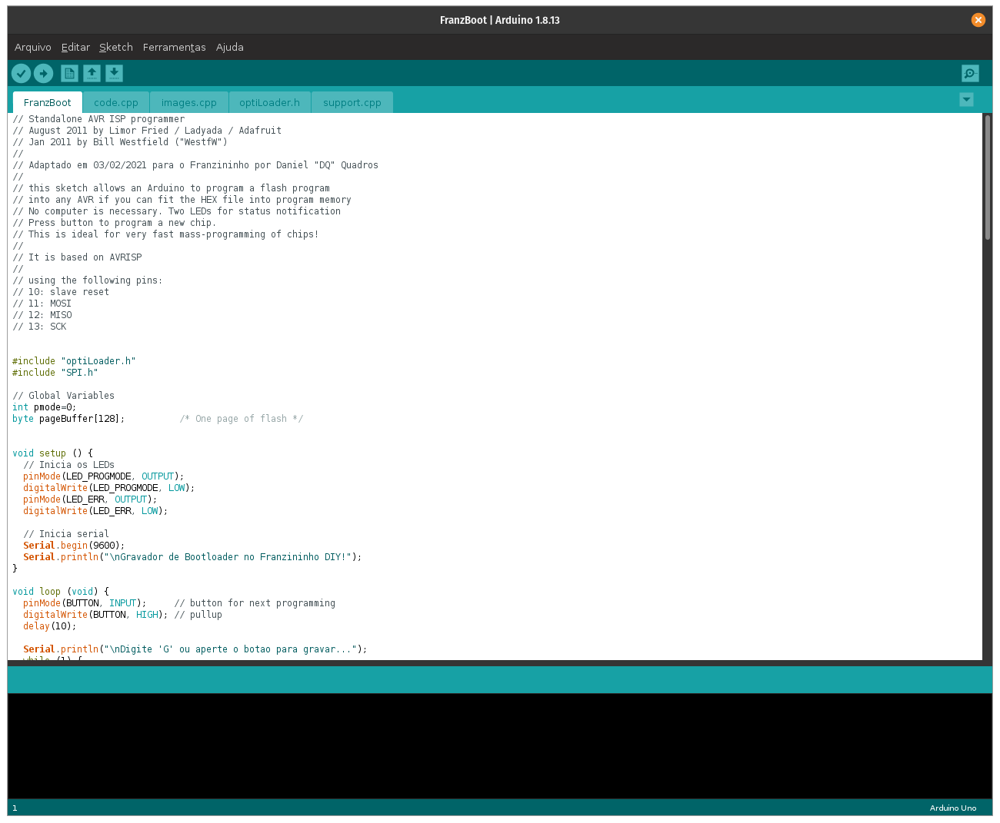
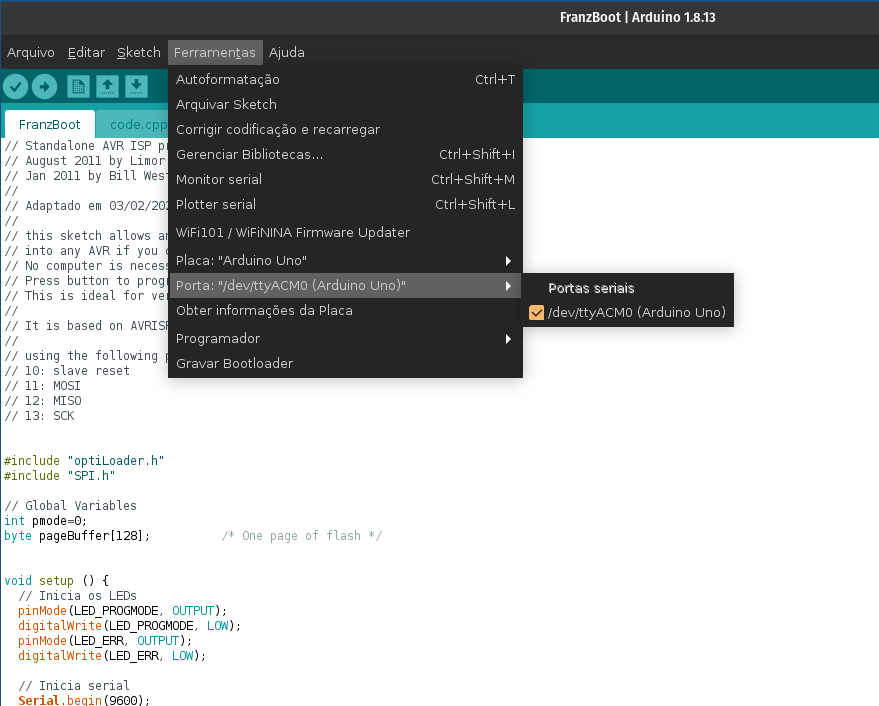
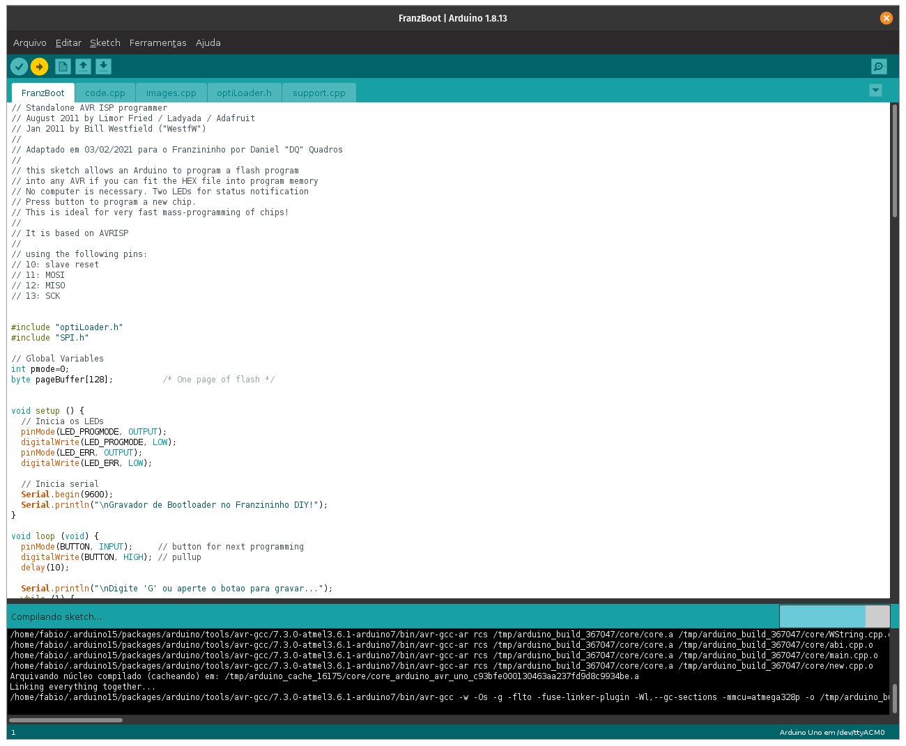
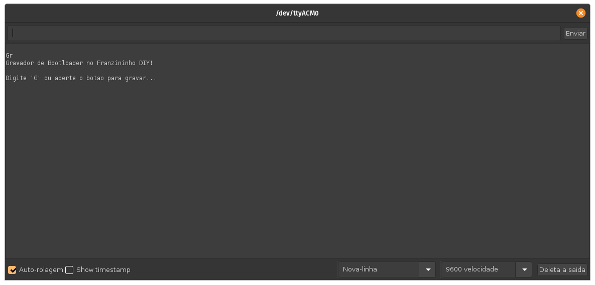

Para que a placa Franzininho possa ser gravada através da USB é necessário gravar o bootloader. O bootloader é um pequeno programa que roda toda vez que a placa é iniciada e verifica se tem um comando de atualização de firmware. Caso tenha esse comando, ele recebe o binário através da USB (no caso da Franzininho DIY) e grava na memória flash.

Na Franzininho DIY usamos o [Micronucleus](https://github.com/micronucleus/micronucleus/blob/master/Devices_with_Micronucleus.md) que é um bootloader pequeno e bem flexível desenvolvido para a família ATtiny usando o projeto [VUSB](https://www.obdev.at/products/vusb/index.html) como base.

A seguir vamos exibir como você pode gravar o ATtiny85 para usar o Micronucleus.

## Materiais Necessários

- Arduino UNO ou similar
- Fios \(Jumpers\)
- Protoboard

## Circuito

Você precisará montar o seguinte circuito:

:::warning Faça uma dupla checagem antes de ligar o Arduino Uno no computador.
:::

Com o circuito Montado, vamos para a gravação do bootloader.

## Gravando o FranzBoot no Arduino UNO

Para facilitar a gravação do bootloader vamos usar o [FranzBoot](https://github.com/Franzininho/FranzBoot), um programa para gravação do bootloader micronucleus para Franzininho DIY usando Arduino UNO.

Baixe o projeto no seu computador: [Download](https://github.com/Franzininho/FranzBoot/archive/refs/heads/main.zip).

Descompacte a pasta e abra o arquivo FranzBoot.ino

:::tip Se ainda não tem a IDE Arduino no seu computador, baixe-a no site do [Arduino](https://www.arduino.cc/en/software)
:::

Será aberta a IDE do Arduino:

Antes de gravar na placa precisamos configurar a IDE para a placa Arduino UNO. Em Paca selecione Arduino UNO e em porta a porta Serial criada para o seu Arduino UNO:

Pronto, agora pressione Upload(Careegar) e aguarde a gravação no Arduino UNO:

Agora abra o terminal serial:

:::tip Verifique se a velocidade está configurada em 9600.
:::

Agora digite e G e pressione enviar. Após a gravação deve ser apresentada a seguinte mensagem no terminal:

:::warning ERRO
Se receber uma mensagem de erro, verifique as conexões elétricas e envie novamente o comando G.
:::

Pronto, o ATtiny85 está pronto para ser encaixado na sua Franzininho DIY. Retire-o com cuidado da matriz de contatos e encaixe-o corretamente na Franzininho DIY, conforme imagem abaixo

## Próximos passos

Agora que já tem a sua placa Franzininho DIY preparada você pode partir para a programação.

## Gravar muitos chips

Caso você necessite gravar muitos chips você pode gravar ser usar o PC. Verifique a [documentação do FranzBoot](https://github.com/Franzininho/FranzBoot#readme) para mais detalhes.
