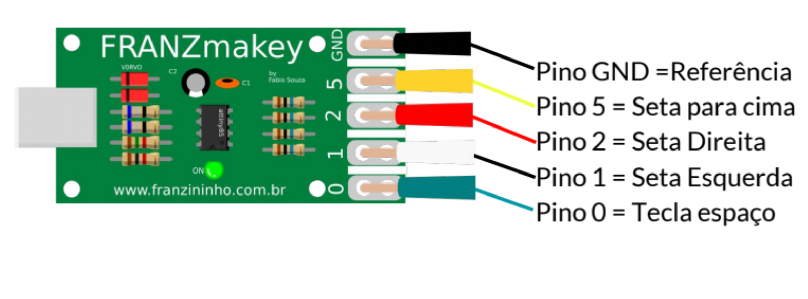
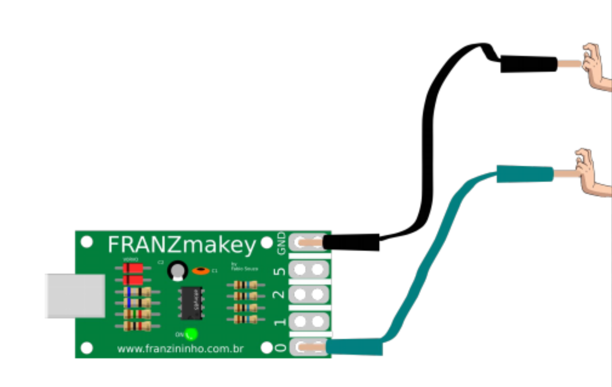
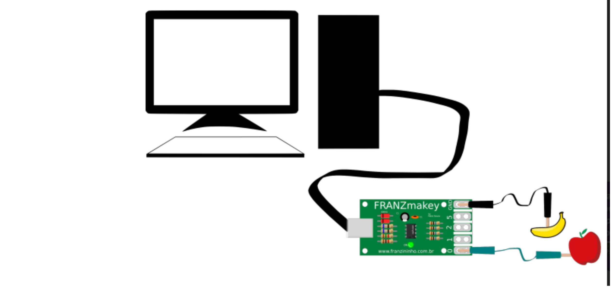
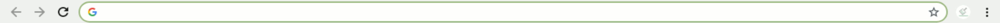

Plaquinha em mão, agora chegou a hora de conhecê-la!

Os pinos do FRANZmakey equivalem as setas do nosso computador, confira na imagem:

## Teste de funcionamento da placa

Pegue duas garrinhas de jacaré e faça as seguintes ligações:

- GND = Terra
- Pino 0 = Tecla espaço

Agora ligue o cabo USB A/B no FranzMakey e a outro conector no USB do computador.

\*por opção você pode inserir frutas nas pontas das garrinhas para o teste.

Agora abra seu navegador e deixe o cursos piscando, conforme a imagem abaixo:

Faça o teste: Segure as duas garrinhas de jacaré, mantenha seu dedo enconstado na parte metálica da garrinha no GND segurando sempre e a outra garrinha você deve tocar e tirar, como se você estivesse dando input do teclado.

Se o cursor começou a andar na barra do seu navegador, sua placa FranzMakey está prontinho!
